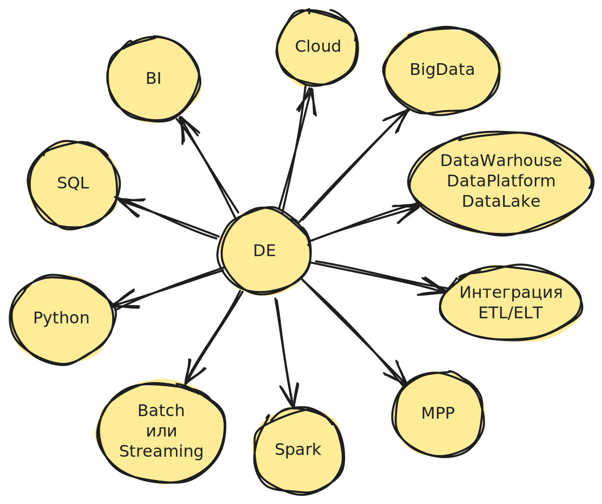

1. Интеграция данных ==ETL/ELT==. Извлечение (extract), трансформация (transform), загрузка (load)
2. ==DataWarhouse (DW)== – хранилище обработанных данных. ==Data Lake (DL)== - озеро данных, хранилище сырых данных. ==Data Platform== - это DW + DL + другие инструменты для работы с данными. 
   Аналогия с кухней.
   ==DW== – это стол, на котором все продукты уже разложены по отдельным емкостям, помытые, очищенные, готовые к приготовлению блюда.
   ==DL== – это холодильник, в котором все продукты лежат в куче. Немытый картофель, неочищенный лук, замороженное мясо. 
   ==DP== – это вся кухня, состоящая из столов, холодильника, плиты, посудомойки и тд.
3. ==Cloud== – облачная аналитика
4. ==Batch== – обработка данных пачками. Данные собираются в пачки и затем обрабатываются по расписанию. Например, почтальон собирает письма и разносит всю пачку 1 раз в день. ==Streaming== – потоковая обработка данных. Данные поступают и сразу же обрабатываются. Например, каждое написанное письмо отправляется курьером сразу же.
5. BI (бизнес аналитика)
6. ==SQL== – язык запросов к базе данных
7. ==Python== – язык программирования
8. ==MPP (Massive Parallel Processing)== – обработка данных множеством серверов одновременно. Т.е. параллельная обработка.
9. ==BigData== – огромное количество данных, которые не помещаются в памяти одного сервера и когда такой объем данных невозможно обработать обычными инструментами типа excel
10. ==Spark== – инструмент для обработки больших объемов данных

