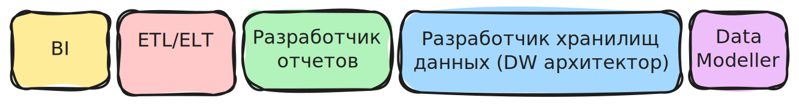

## :material-numeric-1-box: Традичионная категория

### BI

Анализирует данные, строит отчетамы, дашборды, внедряет BI решения (Tableau, Power BI, SAP). Иногда в обязанности входит предоставление бизнес-рекомендаций на основе данных. Находится ближе к бизнесу.

### ETL/ELT

Разрабатывает пайплайны по загрузке данных из разных источников в хранилище. Очищает и обрабатывает данные.

### Разработчик отчетов

Создает отчеты. Меньше аналитики, больше строгое оформление и автоматизация отчетов.

### Разработчик хранилищ данных (DW архитектор)

Проектирует архитектуру хранилища данных, выбирает структуру данных. Мост между бизнесом и ИТ-инфраструктурой.

### Data Modeller

Создает модели данных. Определяет какие таблицы, поля и связи нужны для хранения данных. Акцент на структуре и согласованности данных.

## :material-numeric-2-box: Категория инженера данных

### DE

Строит пайплайны и обрабатывает большие данные. Создает инструменты для аналитиков и ДС. Автоматизирует потоки данных от источников до витрин. Обеспечивает надежную доставку и качество данных.

### BigData

Использует распределенные вычисления и хранилища. Фокус на больших данных и высокой нагрузке.

### Cloud DE

Разворачивает и поддерживает облачную инфраструктуру. Специалист по облачным платформам.

### Data Platform

Разрабатывает платформу и сервисы для всей data команды. Фокус на инфраструктуре и автоматизации.

## :material-numeric-3-box: Профильная категория

### SDE

Разработчик ПО.

### ML

Обучает и внедряет модели машинного обучения.

### Visual Engineer

Создает продвинутые визуализации и графики. Делает кастомные решения для визуализации.

## :material-numeric-4-box: Продвинутая аналитика

### Data Mining

Выявляет закономерности в больших массивах данных. Использует статистику и алгоритмы. Больше фокуса на добыче данных, чем на прогнозах.

### Data Science

Строит модели и делает прогнозы. Анализирует данные и предлагает гипотезы. Комбинация аналитики, машинного обучения и математики.

### Аналитик данных

Анализирует данные и отвечает на бизнес вопросы. Делает SQL запросы, строит отчеты. Находится ближе к бизнесу.

 