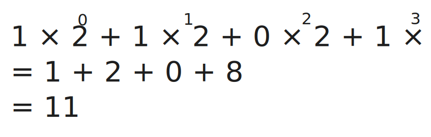
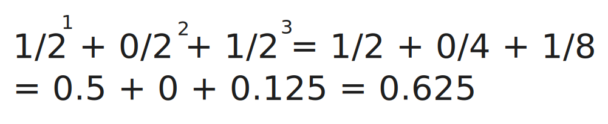
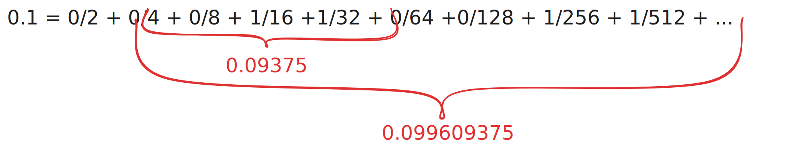

Объекты в программе всегда имеют какой-то тип данных.

Как и в реальном мире:

- ==Дима== это ==человек==
- Ближайшая ==пятерочка== – это ==магазин==
- ==Баланс== на банковской карте (29642,42) – это ==число== с плавающей точкой
- ==Количество страниц== в книге – целое ==число==
- Файл ==budget.xlsx== –  ==таблица Excel==
- ==Утверждения== могут быть ==True== (правда) или ==False== (ложь)
	- Этот тип данных называется `Boolean`
		- "Я Python разработчик" – `True`
		- "Моя кошка любит собак" – `False`

## Integers (Целое число)

`int`

Используются для представления целых чисел: `0`, `1`, `100`, `-100`, и т.д. 
Целые числа имеют ==точное== представление в Python (хранятся и обрабатываются без потери точности)
Целые числа могут быть ==любого размера== (такие большие на сколько хватит памяти)
Целые числа в коде могут быть созданы из ==литералов==

	100
	-100
	10_500_000 (можно использовать символ подчеркивания для лучшей читаемости)

или в результаты вычислений

	1 + 1

## Floats (Число с плавающей точкой)

`float`

Используются для представления дробных чисел: `3.14`, `-1.3`
Дробные числа в коде могут быть созданы из ==литералов==

	3.14
	-1.3
	1_234.567_876

Точка в литерале отличает `float` от `int`

	1 -> int
	1.0 -> float

### Представление числа с плавающей точкой

Есть десятичная дробь `1.234`

В десятичной системе счисления это число можно точно представить в виде дробей:
`1 + 2/10 + 3/100 + 4/1000`

Но не все дробные числа могут иметь конечное представление `1/3`
В качестве дроби данное число конечно, но не в 10сс
`1/3 = 0.333... = 3/10 + 3/100 + 3/1000 + ...`
Бесконечное число дробей

### Представление целого числа

Компьютер "знает" только 2 числа:
`0` и `1` -> ==бинарная== система счисления (по основанию 2)

Любое число в компьютере хранится в бинарной системе
бинарное число `1011` может быть приведено в десятичное число

### Представление числа с плавающей точкой в двоичной системе

Дробные числа хранятся в памяти компьютера тоже в двоичной системе только в виде дробей с основанием 2

Мы уже видели число, которое не имеет конечного представления в 10сс (1/3)
То же самое может быть и в двоичной системе

### Числа с плавающей точкой не всегда точны

Не все числа из 10сс имеют точное представление числа с плавающей точкой на компьютере.
Это не ограничение Python
Все языки программирования имеют этот недостаток точности
Поэтому нужно быть внимательным при сравнении 2х числе с плавающей точкой

Существуют типы данных, которые могут хранить ==точное== представление десятичных дробей
`Decimal`
Но вычисления с использованием `Decimal` на много медленнее чем с `float`