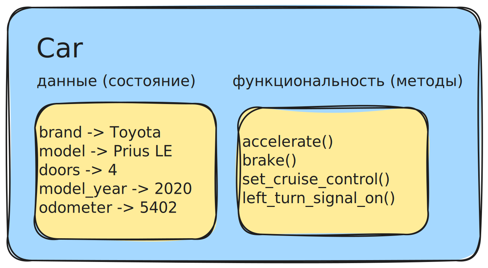

## Что такое объект?

Сущность, которая была создана с помощью самого Python

- имеет состояние (данные)
- имеет методы (функциональность)

Часто объекты представляет вещи из реального мира



## Integer это объекты

`int` это объект

у него есть состояние - это его значение
но `int` так же имеет и функциональность – `int` знает как складывать себя с другим `int`

```python
(10).__add__(100) # 110
```

у `int` есть метод `__add__`, который используется для сложения

`int` знает как отображать себя в виде строки 

## Float тоже объекты

`float` это объект

у него есть состояние - значение
и функциональность - сложение `__add__`

вот пример другого метода

```python
(0.125).as_integer_ratio() # 1, 8
```

`as_integer_ratio` – метод, который приводит `float` к дроби `0.125 = 1/8`

## В Python все является объектом

==Любой тип данных это объект==

- имеет состояние
- имеет функциональность

состояние + функциональность = атрибуты класса

## Точечная нотация

Получить доступ к атрибуту можно через точечную нотацию

`car.brand` – получить доступ к к атрибуту `brand` объекта `Car`
`car.model` – получить доступ к к атрибуту `model` объекта `Car`

чтобы выполнить функцию, нужно вызвать метод с помощью параметров в круглых скобках.

`car.accelerate(10, "kmh")`
`(10).__add__(100)`

## Изменяемые и неизменяемые типы данных

Объект считается изменяемым, если его внутреннее состояние можно изменить 

Объект считается неизменяемым, если его внутреннее состояние нельзя изменить

В Python много неизменяемых типов данных:

- int
- float
- boolean
- string
- ...

B есть изменяемые:

- list
- dictionary
- set
- ...
