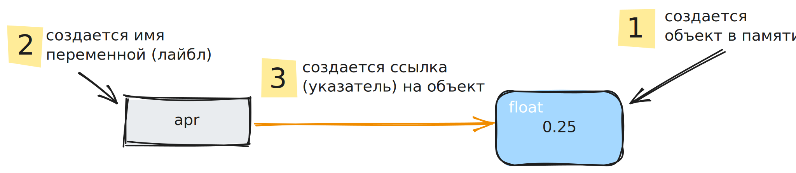
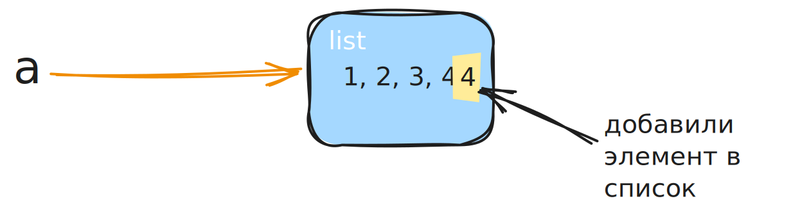
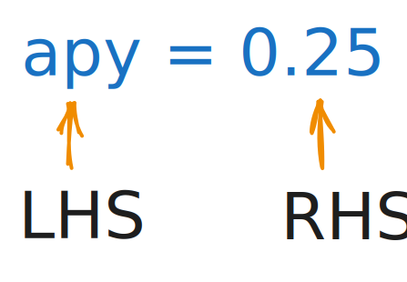

## Наименование объектов

Нам часто нужно дать объекту какое-то имя
имя будет напоминать что за объект используется
примеры имен: `apy`, `account_balance`

имя позволит использовать один и тот же объект в нескольких частях кода

## Присвоение имен

Для присвоения имени объекту используется оператор `=`

	account_balance = 1000.0
	apy = 0.25

объекту 0.25 мы присвоили имя apy
можно сказать, apy ссылкается на объект 0.25

имя apy в настоящий момент указывает (или ссылается) на объект 0.25

## Ссылки и объекты

`apr = 0.25`

Сначала в памяти создается объект `0.25`
затем создается имя переменной и это имя ссылается на объект

`apr` – это ==переменная==
по сути это просто имя или лейбл, который указывает на какой то объект в памяти

## Переменные

Почему переменные называются переменные?

- объект, на который ссылается имя может измениться

	была переменная `a = 100` (a ссылается на объект `100`)
	потом в программе...
	`a = True` (теперь a ссылается на объект `True`)

- состояние объекта может измениться

	`a` ссылается на список `1, 2, 3`
	к списку добавили еще одно число `4`
	список изменился он стал `1, 2, 3, 4`

`a` ссылается на тот же самый объект (список), но состояние объекта изменилось

## Как происходит присвоение переменной

Python видит оператор = и понимает что происходит присвоение переменной
сначала вычисляется правая часть (RHS) 
затем результат присваивается левой части (LHS)
(левая часть имени становится именем результата вычисления правой части)

Правая часть может быть сложнее
`balance = 1000.0 - 50.0`
`circ = 2 * 3.14 * 1.5`
в обоих выражениях сначала вычисляется правая часть

## Использование переменных

После того, как переменная была создана, ее можно использовать в любом месте программы

`pi = 3.1415`
`radius = 1`
`circ = 2 * pi * radius`

после этого кода `circ` ссылается на объект с типом `float 6.283`

если поменять радиус на 2 (`radius = 2`), то значение `circ` никак не изменится
просто переменная `radius` будет ссылаться на объект `2`
а `circ` будет по прежнему ссылаться на объект `6.283`

## Как называть переменные

имена переменных регистрозависимы
имя переменной `apr` отличается от `APR`

### Обязательные правила наименования переменных

имя переменной начинается с `_` или букв `a-z A-Z`
имя переменной продолжается с любого количества символов `_` букв `a-z A-Z` или цифр `0-9`

примеры
`var, my_var, index1, index_1, _var, __var, __add__`
`__add__` - такое имя переменной разрешено, но не нужно его использовать. Имена начинающиеся с двойного подчеркивания и заканчивающиеся двойным подчеркиванием резервируются питоном. И если сейчас какое-то имя не зарезервировано, то в будущих обновлениях не факт что оно будет свободно.

Нельзя использовать зарезервированные слова
`True, False, if, def, and, or...`

### Правила, которых следует придерживаться

[PEP8](https://www.python.org/dev/peps/pep-0008/) – это документ-соглашение, которому следуют большинство разработчиков

camelCase 
слова разделяются заглавными буквами
`accountBalance, BankAccount`

snake_case
слова разделяются символом подчеркивания
`account_balance, bank_account`

Для обычных переменных используется snake_case и все буквы в нижнем регистре
account_balance ✅
account_Balance ❌

