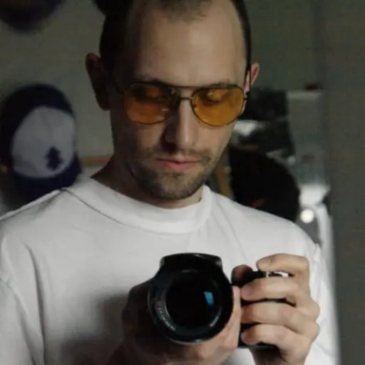

Исходное изображение

## Low Poly Art

|  |        |
| ------------------------------------------------------------------------------------------ | ------------------------------------------------------------------------------------------------ |
| Create an image of low-poly geometric bunny. Square Ratio.                                 | Create an image of low-poly symmetrical brown bear head on solid white background. Square Ratio. |

Перерисуй изображение в стиле low-poly geometric

|  |  |
| ------------------------------------------------------------------------------------------ | ------------------------------------------------------------------------------------------ |
|  |  |

## Graffiti

|        |        |
| ------------------------------------------------------------------------------------------------ | ------------------------------------------------------------------------------------------------ |
| Create an image of graffiti art of the word "YouTube" on a solid white background. Square Ratio. | Create an image of graffiti art of cute hip-hop cartoon hippo character on a wall. Square Ratio. |

## Calligraphy

|                               |                    |
| ----------------------------------------------------------------------------------------------------------------------- | ------------------------------------------------------------------------------------------------------------ |
| Create an image of artistic calligraphy for the word "Summer" in orange color, on solid white background. Square Ratio. | Create an image of artistic calligraphy for the word "Spring", make it beautiful, add flowers. Square Ratio. |

## Typography Art

|                                                                 |                                                                                                    |
| --------------------------------------------------------------------------------------------------------------------------------------------------------- | -------------------------------------------------------------------------------------------------------------------------------------------------------------------------------------------- |
| Create an image of creative typography-based design of the word "ROBOT", 3D render design on a purple background, sci-fi, mech, futuristic. Square Ratio. | Create an image of creative typography-based design of the word "Fresh" made from colorful liquid fluid on a solid white background, splash, 3D rendered, professional, clean. Square Ratio. |

## Etching (офорт)

|           |                                           |
| --------------------------------------------------------------------------------------------------- | ----------------------------------------------------------------------------------------------------------------------------------- |
| Create an image of fine-line etched illustration of a skeleton hand holding an apple. Square Ratio. | Create an image of fine-line etched illustration of a pirate drinking Rum, sitting on the floor next to a Rum barrel. Square Ratio. |
|           |                                                                                                                                     |
| Рука скелета держит яблоко. Стиль офорт, тонкие и толстые прямые линий.                             |                                                                                                                                     |

Перерисуй в стиле офорт. Тонкие и толстые прямые линии.

|  |  |
| ------------------------------------------------------------------------------------------ | ------------------------------------------------------------------------------------------ |
|  |  |

## Woodcut Print

|    |                 |
| -------------------------------------------------------------------------------------------- | --------------------------------------------------------------------------------------------------------- |
| Create an image of bold woodcut print of a gnome portrait smoking from a pipe. Square Ratio. | Create an image of bold woodcut print of an exotic leaf pattern, clean black and white des. Square Ratio. |

## Naive Art

|                                                      |  |
| ---------------------------------------------------------------------------------------------------------------------------------------------- | ------------------------------------------------------------------------------------------ |
| Create an image in Naive Art style of a fat cat sitting with a big full belly. A plate with a fish skeleton in front of the cat. Square Ratio. | Create an image in Naive Art style of a red car. Square Ratio.                             |

Перерисуй изображение в стиле Naive Art

|  |  |
| ------------------------------------------------------------------------------------------ | ------------------------------------------------------------------------------------------ |
|  |  |

## Art Nouveau

|  |                                         |
| ------------------------------------------------------------------------------------------ | --------------------------------------------------------------------------------------------------------------------------------- |
| Create an image of an Art Nouveau style woman with floral decorations. Square Ratio.       | Create an image of an Art Nouveau style illustration of a black deer head with red roses on solid white background. Square Ratio. |

Перерисуй изображение в стиле Art Nouveau

|  |  |
| ------------------------------------------------------------------------------------------ | ------------------------------------------------------------------------------------------ |
|  |  |

## Cubism

|                       |                             |
| --------------------------------------------------------------------------------------------------------------- | --------------------------------------------------------------------------------------------------------------------- |
| Create an image of a cubist portrait with fragmented geometric forms of a vintage business woman. Square Ratio. | Create an image of a cute cubist illustration with a mouse with a cook hat, fragmented geometric forms. Square Ratio. |

Перерисуй изображение в стиле Cubism

|  |  |
| ------------------------------------------------------------------------------------------ | ------------------------------------------------------------------------------------------ |
|  |  |

## Ink Wash Painting

|  |                              |
| ------------------------------------------------------------------------------------------ | ---------------------------------------------------------------------------------------------------------------------- |
| Create an image of an ink wash style bamboo scene with a zen temple. Square Ratio.         | Create an image of an ink wash style mountains with red sun sunset, and a small silhouette of a warrior. Square Ratio. |

Перерисуй изображение в стиле Ink Wash Painting

|  |  |
| ------------------------------------------------------------------------------------------ | ------------------------------------------------------------------------------------------ |
|  |  |
|                                                                                            |                                                                                            |

## Chibi Style

|                                  |                                  |
| -------------------------------------------------------------------------------------------------------------------------- | -------------------------------------------------------------------------------------------------------------------------- |
| Create an image of a chibi-style bunny holding a carrot with a big smile, on a solid pastel pink background. Square Ratio. | Create an image of a chibi-style girl with oversized glasses holding a cup of hot cocoa, sitting on a cloud. Square Ratio. |

Перерисуй изображение в стиле Chibi Style

|  |  |
| ------------------------------------------------------------------------------------------ | ------------------------------------------------------------------------------------------ |
| ![[Pasted image 20250519165847.png]]                                                       | ![[Pasted image 20250519165851.png]]                                                       |

Перерисуй изображение в стиле Chibi Style, vector graphics, solid pastel colors, no gradients

|  |  |
| ------------------------------------------------------------------------------------------ | ------------------------------------------------------------------------------------------ |
| ![[Pasted image 20250521143314.png]]                                                       | ![[Pasted image 20250521143318.png]]                                                       |

## Kawaii

|                                                |                                         |
| ---------------------------------------------------------------------------------------------------------------------------------------- | --------------------------------------------------------------------------------------------------------------------------------- |
| Create an image of a kawaii-style smiling star with pastel colors, surrounded by tiny hearts, on a solid white background. Square Ratio. | Create an image of a kawaii-style smiling donut with sprinkles, with a cute face, on a solid light blue background. Square Ratio. |

## Claymation

|                                                                   |                                                                                  |
| ----------------------------------------------------------------------------------------------------------------------------------------------------------- | -------------------------------------------------------------------------------------------------------------------------------------------------------------------------- |
| Create an image of a claymation-style chubby bunny character with big, expressive eyes and a carrot in its hands, on a soft green background. Square Ratio. | Create an image of a claymation-style teapot with intricate, hand-molded textures, surrounded by clay cups and plates, all sitting on a hand-sculpted table. Square Ratio. |

Перерисуй изображение в стиле Claymation-style

|  |  |
| ------------------------------------------------------------------------------------------ | ------------------------------------------------------------------------------------------ |
|  |  |

## Dreamcore

|                                                                 |                                                                                                                       |
| --------------------------------------------------------------------------------------------------------------------------------------------------------- | --------------------------------------------------------------------------------------------------------------------------------------------------------------------------------------------------------------- |
| Create a dreamcore style image of a surreal landscape with floating, distorted clocks, oversized objects, and a hazy, dreamlike atmosphere. Square Ratio. | Create a dreamcore style image of a dreamlike bedroom with mismatched furniture, a cracked mirror reflecting a distorted version of the room, and strange shadows cast by a floating, unlit lamp. Square Ratio. |

## Normalcore

|                |                 |
| -------------------------------------------------------------------------------------------------------- | --------------------------------------------------------------------------------------------------------- |
| Create a normalcore image of a quiet suburban street with neat houses and well-kept lawns. Square Ratio. | Create a normalcore image of a plain office desk with a computer, papers, and a coffee mug. Square Ratio. |

## Weirdcore

|  |  |
| ------------------------------------------------------------------------------------------ | ------------------------------------------------------------------------------------------ |
| Create a weirdcore illustration of a strange ugly cat. Square Ratio.                       | Create a weirdcore photo of a cottage in the forest. Square Ratio.                         |

Перерисуй изображение в стиле Weirdcore

|  |  |
| ------------------------------------------------------------------------------------------ | ------------------------------------------------------------------------------------------ |
|  |  |

## Biopunk

|                |                               |
| -------------------------------------------------------------------------------------------------------- | ----------------------------------------------------------------------------------------------------------------------- |
| Create a biopunk photo of a city with organic buildings and glowing bioluminescent plants. Square Ratio. | Create a biopunk cartoon 3D render of a scientist working in a lab surrounded by glowing plants and tech. Square Ratio. |

## Post-Apocalyptic

|                  |                        |
| ---------------------------------------------------------------------------------------------------------- | ---------------------------------------------------------------------------------------------------------------- |
| Create a post-apocalyptic photo of a ruined city overrun by nature with crumbling buildings. Square Ratio. | Create a post-apocalyptic illustration of a lone survivor standing in a destroyed urban landscape. Square Ratio. |

## Mosaic

|  |  |
| ------------------------------------------------------------------------------------------ | ------------------------------------------------------------------------------------------ |
| Create a mosaic image of a colorful bird made up of small, geometric tiles. Square Ratio.  | Create a mosaic image of a UFO flying over a mountain. Square Ratio.                       |

## Fluid Art

|  |                                                 |
| ------------------------------------------------------------------------------------------ | ----------------------------------------------------------------------------------------------------------------------------------------- |
| Create a fluid art image of swirling colors blending together, liquid paint. Square Ratio. | Create a fluid art image with vibrant paint flowing and mixing into organic, marbled shapes, liquid gold and emerald green. Square Ratio. |

## Ferrofluid style

|                        |                             |
| ---------------------------------------------------------------------------------------------------------------- | --------------------------------------------------------------------------------------------------------------------- |
| Create a ferrofluid image of a skull with metallic fluid forming sharp, spiked patterns around it. Square Ratio. | Create a ferrofluid image of a black rose with fluid forming magnetic spikes along its petals and stem. Square Ratio. |

Перерисуй изображение в стиле Ferrofluid style with metallic fluid forming sharp
(результат мне не понравился, надо будет поработать над стилем)

|  |  |
| ------------------------------------------------------------------------------------------ | ------------------------------------------------------------------------------------------ |
|  |  |

## Byzantine Icon

|                        |                                                                            |
| ---------------------------------------------------------------------------------------------------------------- | -------------------------------------------------------------------------------------------------------------------------------------------------------------------- |
| Create a Byzantine icon-style painting of a green alien saint with a golden halo and ornate robes. Square Ratio. | Create a Byzantine icon-style minimalist vector style illustration of a warrior bunny figure with a symmetrical, detailed background and gold accents. Square Ratio. |

Перерисуй в стиле Byzantine icon-style minimalist vector style illustration

|  |  |
| ------------------------------------------------------------------------------------------ | ------------------------------------------------------------------------------------------ |
|  |  |

## Cyberpunk

|                                                      |                     |
| ---------------------------------------------------------------------------------------------------------------------------------------------- | ------------------------------------------------------------------------------------------------------------- |
| Create a cyberpunk portrait photo of a woman with cybernetic enhancements, standing in a dark alley with glowing advertisements. Square Ratio. | Create a cyberpunk image of a futuristic flying purple car 3D render on solid white background. Square Ratio. |

## Steampunk

|                   |                              |
| ----------------------------------------------------------------------------------------------------------- | ---------------------------------------------------------------------------------------------------------------------- |
| Create a steampunk image of a vintage car with brass gears, pipes, and steam-powered engines. Square Ratio. | Create a steampunk image of a Victorian woman with a hat, adorned with gears and mechanical accessories. Square Ratio. |

## Zentangle

|                           |                                         |
| ------------------------------------------------------------------------------------------------------------------- | --------------------------------------------------------------------------------------------------------------------------------- |
| Create a Zentangle pencil drawing image of a cat silhouette filled with complex, repetitive patterns. Square Ratio. | Create a beautiful clean Zentangle pencil drawing of a butterfly, its wings filled with detailed, flowing patterns. Square Ratio. |

## Y2K Aesthetic

|                 |                             |
| --------------------------------------------------------------------------------------------------------- | --------------------------------------------------------------------------------------------------------------------- |
| Create a Y2K aesthetic image of a retro computer with glowing buttons and digital patterns. Square Ratio. | Create a Y2K aesthetic portrait of a girl with holographic makeup and a futuristic, metallic hairstyle. Square Ratio. |

## Doodle Art

|         |  |
| ------------------------------------------------------------------------------------------------- | ------------------------------------------------------------------------------------------ |
| Create a doodle art image of a smiling sun surrounded by clouds, stars, and hearts. Square Ratio. | Create a doodle art image of a smart lightbulb. Square Ratio.                              |

## Folk Art

|                          |                               |
| ------------------------------------------------------------------------------------------------------------------ | ----------------------------------------------------------------------------------------------------------------------- |
| Create a folk art image of a whimsical tree with hearts and flowers painted in vibrant, bold colors. Square Ratio. | Create a folk art image of a village scene with hand-painted houses, animals, and flowers in warm colors. Square Ratio. |

## Lofi Art

|                                 |                                             |
| ------------------------------------------------------------------------------------------------------------------------- | ------------------------------------------------------------------------------------------------------------------------------------- |
| Create a lofi art image of a cozy room with a window showing a rainy street, a cup of tea, and a soft glow. Square Ratio. | Create a lofi art image of a person with headphones listening to music while drawing at their desk, with soft lighting. Square Ratio. |

Перерисуй изображение в стиле lofi art

|  |  |
| ------------------------------------------------------------------------------------------ | ------------------------------------------------------------------------------------------ |
|  |  |

## Comic Book Style

|                                                 |                                                    |
| ----------------------------------------------------------------------------------------------------------------------------------------- | -------------------------------------------------------------------------------------------------------------------------------------------- |
| Create a comic book-style image of a pink superhero girl flying through the city, with bold lines and action-packed colors. Square Ratio. | Create a comic book-style image of a battle scene between a bunny and a turtle with dynamic poses and exaggerated expressions. Square Ratio. |

## Art Brut

|                                              |  |
| -------------------------------------------------------------------------------------------------------------------------------------- | ------------------------------------------------------------------------------------------ |
| Create an art brut image of a raw, unrefined portrait of a bunny with intense emotions and childlike, spontaneous lines. Square Ratio. | Create an art brut painting of a woman, expressive, freeform strokes. Square Ratio.        |

Перерисуй в стиле art brut. expressive, freeform strokes

|  |  |
| ------------------------------------------------------------------------------------------ | ------------------------------------------------------------------------------------------ |
|  |  |

## Tachisme

|                                                                  |                                              |
| ---------------------------------------------------------------------------------------------------------------------------------------------------------- | -------------------------------------------------------------------------------------------------------------------------------------- |
| Create a tachisme image of spontaneous brush strokes, splattered paint, and abstract color blocks in an emotional, unstructured composition. Square Ratio. | Create a tachisme image of a red rose, energetic canvas filled with expressive splashes of color and random brush marks. Square Ratio. |

## Dadaism

|                                       |                                                             |
| ------------------------------------------------------------------------------------------------------------------------------- | ----------------------------------------------------------------------------------------------------------------------------------------------------- |
| Create a dadaism image of an absurd, chaotic collage made up of random, disconnected objects and abstract shapes. Square Ratio. | Create a dadaism image of a surreal scene representing love, where everyday objects are placed in unexpected, nonsensical arrangements. Square Ratio. |

## Pre-Raphaelite

|                                               |                                                               |
| --------------------------------------------------------------------------------------------------------------------------------------- | ------------------------------------------------------------------------------------------------------------------------------------------------------- |
| Create a pre-Raphaelite image of a young woman with flowing red hair, surrounded by lush nature and soft, detailed light. Square Ratio. | Create a pre-Raphaelite image of a bunny knight in a mythical scene with elaborate details, vivid colors, and an ethereal, romantic mood. Square Ratio. |

## Futurist Architecture

|                                                                |                                                     |
| -------------------------------------------------------------------------------------------------------------------------------------------------------- | --------------------------------------------------------------------------------------------------------------------------------------------- |
| Create a futurist architecture photo of sleek, angular buildings with dramatic curves and sharp edges, set against a minimalist landscape. Square Ratio. | Create a futurist architecture image of a city skyline with floating buildings, sharp lines, and a high-tech, sleek appearance. Square Ratio. |

## Wabi-Sabi

|  |                                         |
| ------------------------------------------------------------------------------------------ | --------------------------------------------------------------------------------------------------------------------------------- |
| Create a wabi-sabi photo of a home interior. Square Ratio.                                 | Create a wabi-sabi image of a tea cup with imperfections, surrounded by natural, organic textures and muted colors. Square Ratio. |

## Zettiology

|                                                      |                                                             |
| ---------------------------------------------------------------------------------------------------------------------------------------------- | ----------------------------------------------------------------------------------------------------------------------------------------------------- |
| Create a zettiology image of a highly detailed, futuristic city with intricate patterns and textures blended with organic forms. Square Ratio. | Create a zettiology image of a mechanical creature, blending sharp edges with flowing, natural designs, in a dark, atmospheric setting. Square Ratio. |

## Fossil Art

|                                                        |  |
| ------------------------------------------------------------------------------------------------------------------------------------------------ | ------------------------------------------------------------------------------------------ |
| Create a fossil art image of intricate, fossilized cute sea creature etched into stone, with rich textures and detailed line work. Square Ratio. | Create a fossil art image of a vintage phone. Square Ratio.                                |

## Phantasmagoria

|                                                    |                                          |
| -------------------------------------------------------------------------------------------------------------------------------------------- | ---------------------------------------------------------------------------------------------------------------------------------- |
| Create a phantasmagoria image of a ghostly figure floating through a dark, mist-filled landscape with eerie, surreal lighting. Square Ratio. | Create a phantasmagoria image of shifting, translucent faces emerging from an empty room, lit by flickering candles. Square Ratio. |

## Mesoamerican Revival

|                                  |                                        |
| -------------------------------------------------------------------------------------------------------------------------- | -------------------------------------------------------------------------------------------------------------------------------- |
| Create a Mesoamerican revival image of an ancient temple adorned with vibrant murals and intricate carvings. Square Ratio. | Create a Mesoamerican revival image of a warrior figure with intricate armor and ceremonial garb, set in a jungle. Square Ratio. |

## Xeno-Art

|  |  |
| ------------------------------------------------------------------------------------------ | ------------------------------------------------------------------------------------------ |
| Create a xeno-art image of a home. Square Ratio.                                           | Create a xeno-art image of cute bunny in an alien environment. Square Ratio.               |

## Neo-Primitive Art

|                                                                |                                                                |
| -------------------------------------------------------------------------------------------------------------------------------------------------------- | -------------------------------------------------------------------------------------------------------------------------------------------------------- |
| Create a neo-primitive art image of a boat with simple, rough shapes and natural elements, blending modern abstraction with ancient forms. Square Ratio. | Create a neo-primitive art image of a figure formed from tribal lines and earthy tones, resembling a cave painting with modern influences. Square Ratio. |

## Wunderkammer

|  |                                                           |
| ------------------------------------------------------------------------------------------ | --------------------------------------------------------------------------------------------------------------------------------------------------- |
| Create a wunderkammer image of a vintage travel suitcase. Square Ratio.                    | Create a wunderkammer image of a display case filled with unusual objects such as rare artifacts, seashells, and ancient curiosities. Square Ratio. |

## Cave Art

|                          |                                     |
| ------------------------------------------------------------------------------------------------------------------ | ----------------------------------------------------------------------------------------------------------------------------- |
| Create a cave art image of a prehistoric animal drawn in simple lines, set on a textured stone wall. Square Ratio. | Create a cave art image of a figure with primitive tools and hunting scenes, resembling ancient cave paintings. Square Ratio. |

## Parallel Worlds

|                                                                            |                                                                       |
| -------------------------------------------------------------------------------------------------------------------------------------------------------------------- | --------------------------------------------------------------------------------------------------------------------------------------------------------------- |
| Create a parallel worlds image of two overlapping cities, one futuristic and high-tech, the other ancient and weathered, blending one city to another. Square Ratio. | Create a parallel worlds image of a person standing at the center of two different realities, one bright and one dark, with different landscapes. Square Ratio. |

## Organic Geometry

|                                                                             |                                     |
| --------------------------------------------------------------------------------------------------------------------------------------------------------------------- | ----------------------------------------------------------------------------------------------------------------------------- |
| Create an organic geometry image of flowing red ketchup, organic shapes arranged in a geometric pattern, combining natural forms with structured lines. Square Ratio. | Create an organic geometry image of a tree with spiraling branches and leaves that form a mathematical pattern. Square Ratio. |

## Hollow Art

|                                      |                                                    |
| ------------------------------------------------------------------------------------------------------------------------------ | -------------------------------------------------------------------------------------------------------------------------------------------- |
| Create a hollow art image of a person with a transparent body, showing the intricate gears and machinery inside. Square Ratio. | Create a hollow art image of a tree with its branches and roots cut out, revealing its hollow interior and intricate patterns. Square Ratio. |

## Exquisite Corpse

|                                                             |                                                        |
| ----------------------------------------------------------------------------------------------------------------------------------------------------- | ------------------------------------------------------------------------------------------------------------------------------------------------ |
| Create an exquisite corpse image of a surreal figure made by combining disjointed body parts and odd elements, blending various styles. Square Ratio. | Create an exquisite corpse image of a creature with random, mismatched parts like a human head, animal body, and mechanical limbs. Square Ratio. |

## Anachronistic Art

|  |                                                                  |
| ------------------------------------------------------------------------------------------ | ---------------------------------------------------------------------------------------------------------------------------------------------------------- |
| Create an anachronistic art image of a medieval knight. Square Ratio.                      | Create an anachronistic art image of a Renaissance-style portrait with the subject wearing a modern-day outfit and holding a digital device. Square Ratio. |

## Vernacular Art

|  |                                                            |
| ------------------------------------------------------------------------------------------ | ---------------------------------------------------------------------------------------------------------------------------------------------------- |
| Create a vernacular art image of a vase of flowers. Square Ratio.                          | Create a vernacular art image of a bustling marketplace, filled with colorful, organic forms and a straightforward, naive perspective. Square Ratio. |

## Biomorphic Art

|  |                                                 |
| ------------------------------------------------------------------------------------------ | ----------------------------------------------------------------------------------------------------------------------------------------- |
| Create a biomorphic art image of a cat in a dreamlike space. Square Ratio.                 | Create a biomorphic art image of a creature with fluid, curving shapes, its form blending with the surrounding environment. Square Ratio. |

## Art Informel

|  |                                           |
| ------------------------------------------------------------------------------------------ | ----------------------------------------------------------------------------------------------------------------------------------- |
| Create an art informel image of a bunny. Square Ratio.                                     | Create an art informel image of gorilla, chaotic paint splatters and drips, creating a freeform, emotional landscape. Square Ratio. |

## Molecular Art

|  |  |
| ------------------------------------------------------------------------------------------ | ------------------------------------------------------------------------------------------ |
| Create a molecular art image of flamingo. Square Ratio                                     | Create a molecular art image of a tree of life, magical. Square Ratio.                     |

## Chalk Art

|                                                 |  |
| ----------------------------------------------------------------------------------------------------------------------------------------- | ------------------------------------------------------------------------------------------ |
| Create a chalk art image of a 3D illusion of a crack in the ground, with bright, contrasting colors and a realistic shadow. Square Ratio. | Create a chalk art image of a cute dino chasing a cat, on a blackboard. Square Ratio.      |

Перерисуй изображение в стиле chalk art in the ground

|  |  |
| ------------------------------------------------------------------------------------------ | ------------------------------------------------------------------------------------------ |
|  |  |

## Gouache Painting

|                            |                                                            |
| -------------------------------------------------------------------------------------------------------------------- | ---------------------------------------------------------------------------------------------------------------------------------------------------- |
| Create a gouache painting of a serene mountain landscape, with rich, layered colors and soft textures. Square Ratio. | Create a gouache painting of a cute, playful monkey with big, expressive eyes, sitting on a branch surrounded by soft, leafy greenery. Square Ratio. |

## Renaissance Painting

|                                                               |                                                        |
| ------------------------------------------------------------------------------------------------------------------------------------------------------- | ------------------------------------------------------------------------------------------------------------------------------------------------ |
| Create a Renaissance painting of a noblewoman in an elaborate gown, with soft lighting and delicate details in the fabric and background. Square Ratio. | Create a Renaissance painting of an angelic figure with delicate wings, glowing in soft light amidst a dramatic, ornate landscape. Square Ratio. |

Перерисуй изображение в стиле Renaissance Painting

|  |  |
| ------------------------------------------------------------------------------------------ | ------------------------------------------------------------------------------------------ |
|  |  |

## Fresco

|                                                      |                    |
| ---------------------------------------------------------------------------------------------------------------------------------------------- | ------------------------------------------------------------------------------------------------------------ |
| Create a fresco-style image of a man sitting with a laptop inside a cave, illuminated by god rays, surrounded by rocky textures. Square Ratio. | Create a whimsical fresco-style image of a cat king painted on a cracked wall inside a temple. Square Ratio. |

## Stained Glass

|                                             |                                                   |
| ------------------------------------------------------------------------------------------------------------------------------------- | ------------------------------------------------------------------------------------------------------------------------------------------- |
| Create a stained glass image of a majestic peacock with vibrant blue and green feathers, set against a sunlit backdrop. Square Ratio. | Create a stained glass image of a rose with intricate petals, glowing in rich shades of red and pink, framed by dark outlines. Square Ratio |

## Concept Art Sketch

|                                                         |  |
| ------------------------------------------------------------------------------------------------------------------------------------------------- | ------------------------------------------------------------------------------------------ |
| Create a concept art sketch of a warrior in battle armor, holding a glowing weapon, with simple, dynamic lines and minimal shading. Square Ratio. | Create a concept art sketch of a dragon. Square Ratio.                                     |

Перерисуй изображение в стиле Concept Art Sketch

|  |  |
| ------------------------------------------------------------------------------------------ | ------------------------------------------------------------------------------------------ |
|  |  |

## Anime

|                                               |                                                    |
| --------------------------------------------------------------------------------------------------------------------------------------- | -------------------------------------------------------------------------------------------------------------------------------------------- |
| Create an anime-style portrait of a catgirl with cat ears and a mischievous smile, surrounded by colorful, soft lighting. Square Ratio. | Create an anime image of a warrior princess with a flowing cape and a staff, standing in front of a castle under a starry sky. Square Ratio. |

## Cartoon 2D & 3D

|                                       |                                                 |
| ------------------------------------------------------------------------------------------------------------------------------- | ----------------------------------------------------------------------------------------------------------------------------------------- |
| Create a 3D cartoon image of a chunky, round panda with exaggerated facial features, sitting on a patch of grass. Square Ratio. | Create a 2D cartoon image of a mischievous cat knocking over a vase, with exaggerated expressions and bold, thick outlines. Square Ratio. |

Перерисуй изображение в стиле 3d cartoon

|  |  |
| ------------------------------------------------------------------------------------------ | ------------------------------------------------------------------------------------------ |
|  |  |

## Retro Vector Art

|                                                     |                                                                 |
| --------------------------------------------------------------------------------------------------------------------------------------------- | --------------------------------------------------------------------------------------------------------------------------------------------------------- |
| Create a retro vector art image of a beach scene with a retro camper van, palm trees, and surfers, all in bright, poppy colors. Square Ratio. | Create a retro vector art image of a vintage radio with dial knobs, surrounded by rays of colorful soundwaves and patterns in pastel tones. Square Ratio. |

## Sgraffito Art

|  |                                                               |
| ------------------------------------------------------------------------------------------ | ------------------------------------------------------------------------------------------------------------------------------------------------------- |
| Create a sgraffito art image of a bunny. Square Ratio.                                     | Create a sgraffito art image of a lion’s face, with intricate fur details and facial features revealed through layers of scratched color. Square Ratio. |

## Stamp Art

|                                                                               |                                            |
| ----------------------------------------------------------------------------------------------------------------------------------------------------------------------- | ------------------------------------------------------------------------------------------------------------------------------------ |
| Create a stamp art image of a vintage postage stamp featuring a detailed illustration of an old-world lighthouse, with textured borders and faded colors. Square Ratio. | Create a travel stamp art image of a scenic beach with palm trees and a sunset, framed with decorative lines and text. Square Ratio. |

## Assemblage Art

|  |                                                                |
| ------------------------------------------------------------------------------------------ | -------------------------------------------------------------------------------------------------------------------------------------------------------- |
| Create an assemblage art piece of a bird. Square Ratio.                                    | Create an assemblage art piece using various small household items like buttons, coins, and fabric scraps, forming a portrait of a person. Square Ratio. |

## Indian Mural Painting

|    |              |
| -------------------------------------------------------------------------------------------- | ------------------------------------------------------------------------------------------------------ |
| Create an Thai mural painting of a toucan bird coming out from a lotus flower. Square Ratio. | Create an Thai mural painting of king sitting on a throne made from gold, in the jungle. Square Ratio. |

## Egyptian Mural Painting

|  |  |
| ------------------------------------------------------------------------------------------ | ------------------------------------------------------------------------------------------ |
| Create an Egyptian mural painting of a pharaoh talking to an alien. Square Ratio.          | Create an Egyptian mural painting of a UFO building a pyramid. Square Ratio.               |

## Tibetan Thangka Painting

|                                                                       |                                                 |
| --------------------------------------------------------------------------------------------------------------------------------------------------------------- | ----------------------------------------------------------------------------------------------------------------------------------------- |
| Create a Tibetan Thangka painting of a serene Buddha in meditation, surrounded by lotus flowers and intricate mandala patterns in the background. Square Ratio. | Create a Tibetan Thangka painting of a bunny with multiple arms, each holding symbolic items, and intricate gold detailing. Square Ratio. |

## Sumi-e Painting

|                                                                     |                                                                   |
| ------------------------------------------------------------------------------------------------------------------------------------------------------------- | ----------------------------------------------------------------------------------------------------------------------------------------------------------- |
| Create a Sumi-e painting of a lone crane standing by a tranquil pond, with delicate brush strokes and soft shading to evoke peace and elegance. Square Ratio. | Create a Sumi-e painting of a tiger in motion, with fluid strokes to convey power and grace, and subtle brushwork for the texture of its fur. Square Ratio. |

## Ukiyo-e Style

|                 |  |
| --------------------------------------------------------------------------------------------------------- | ------------------------------------------------------------------------------------------ |
| Create an Ukiyo-e style image of a serene Japanese garden with koi fish swimming in a pond. Square Ratio. | Create an Ukiyo-e style image of a samurai bunny. Square Ratio.                            |

Перерисуй изображение в стиле Ukiyo-e Style

|  |  |
| ------------------------------------------------------------------------------------------ | ------------------------------------------------------------------------------------------ |
|  |  |

## Splash Ink Painting

|                                                                                                              |                                                                 |
| ------------------------------------------------------------------------------------------------------------------------------------------------------------------------------------------------------ | --------------------------------------------------------------------------------------------------------------------------------------------------------- |
| Create a splash ink painting of a tree with branches and leaves, where the ink splashes create a dynamic, fluid form of the foliage, blending with brushwork to form a harmonious scene. Square Ratio. | Create a splash ink painting of a wild horse galloping through the scene, with ink splashes forming the flowing mane and powerful movement. Square Ratio. |

## Rorschach Inkblot Art

|                                                                                 |                                                                                |
| ------------------------------------------------------------------------------------------------------------------------------------------------------------------------- | ------------------------------------------------------------------------------------------------------------------------------------------------------------------------ |
| Create an abstract Rorschach inkblot image with symmetrical shapes and organic forms, leaving room for the viewer to interpret the design in their own way. Square Ratio. | Create a surreal Rorschach inkblot piece that evokes the shape of a fantastical creature, using symmetrical, flowing ink splatters to form organic shapes. Square Ratio. |

## Etegami Painting

|                                                                                                       |                                                                 |
| ----------------------------------------------------------------------------------------------------------------------------------------------------------------------------------------------- | --------------------------------------------------------------------------------------------------------------------------------------------------------- |
| Create an Etegami painting of a sunflower, using bold, simple brushstrokes to capture its vibrant petals and large, round center, with a small handwritten message in the corner. Square Ratio. | Create an Etegami painting of a cat curled up in a basket, with loose, expressive brushwork capturing the warmth and comfort of the moment. Square Ratio. |

Перерисуй изображение в стиле Etegami Painting

|  |  |
| ------------------------------------------------------------------------------------------ | ------------------------------------------------------------------------------------------ |
|  |  |

## Felt tip pen drawing

|                                                                    |                                                                      |
| ------------------------------------------------------------------------------------------------------------------------------------------------------------ | -------------------------------------------------------------------------------------------------------------------------------------------------------------- |
| Create a felt-tip pen drawing of a person’s face with strong, defined lines for facial features, using cross-hatching for shading and texture. Square Ratio. | Create a felt-tip pen drawing of a vase of flowers on a table, with clean lines for the vase and detailed shading to show reflections and light. Square Ratio. |

Перерисуй изображение в стиле Felt tip pen drawing

|  |  |
| ------------------------------------------------------------------------------------------ | ------------------------------------------------------------------------------------------ |
|  |  |

## Flat Corporate Memphis Style

|  |                                                                                                                                |
| ------------------------------------------------------------------------------------------ | ------------------------------------------------------------------------------------------------------------------------------------------------------------------------------------------------------------------------ |
| Create a Flat Corporate Memphis style design of a woman running. Square Ratio.             | Create a Flat Corporate Memphis style icon set, featuring simple, geometric shapes for common office tools like a printer, coffee cup, a briefcase and smartphone, using bright colors and minimal detail. Square Ratio. |

## Visionary Art

|  |                                                                                              |
| ------------------------------------------------------------------------------------------ | -------------------------------------------------------------------------------------------------------------------------------------------------------------------------------------- |
| Create a visionary art piece of a geisha. Square Ratio.                                    | Create a visionary art piece of a shamanic figure sitting in meditation, with light flowing from their body and connecting with animals, plants, and celestial energies. Square Ratio. |

## Rococo Style

|                                                                                       |                                                                              |
| ------------------------------------------------------------------------------------------------------------------------------------------------------------------------------- | ---------------------------------------------------------------------------------------------------------------------------------------------------------------------- |
| Create a Rococo-style portrait of a woman in an elaborate gown, with flowing curls, lace, and delicate floral accents, set against a soft, decorative background. Square Ratio. | Create a Rococo-style fashion illustration of a nobleman in a lavish powdered wig and velvet suit, surrounded by ornamental elements and floral accents. Square Ratio. |

## Gothic Art

|                                                                                          |                                                                            |
| ---------------------------------------------------------------------------------------------------------------------------------------------------------------------------------- | -------------------------------------------------------------------------------------------------------------------------------------------------------------------- |
| Create a Gothic-style portrait of a noblewoman in a dark, ornate gown, with pale skin and expressive, somber eyes, surrounded by dark, detailed background elements. Square Ratio. | Create a Gothic-style still life of a skull, old books, and candles, with dark shadows and dramatic lighting, creating an eerie and somber atmosphere. Square Ratio. |

## Cute Vector SVG Style

|                                 |                                  |
| ------------------------------------------------------------------------------------------------------------------------- | -------------------------------------------------------------------------------------------------------------------------- |
| Create a cute vector SVG illustration of a smiling cat with big eyes, soft round shapes, and pastel colors. Square Ratio. | Create a cute vector SVG illustration of a vintage car silhouette, all in black on a solid white background. Square Ratio. |

## Mix of Styles: Cute 3D + Xeno-art + Biomorphic + Ferrofluid

|                                   |                                          |
| --------------------------------------------------------------------------------------------------------------------------- | ---------------------------------------------------------------------------------------------------------------------------------- |
| Create a cute 3d render illustration of a bunny in the style of xeno-art combined with biomorphic art and ferrofluid style. | Create a cute 3d render illustration of a colorful car in the style of xeno-art combined with biomorphic art and ferrofluid style. |

## Mix of Styles: Vector + Mesoamerican revival + Splash Ink Painting

|                                                                   |                                                                                                    |
| ----------------------------------------------------------------------------------------------------------------------------------------------------------- | -------------------------------------------------------------------------------------------------------------------------------------------------------------------------------------------- |
| Create a clean vector illustration of a bunny in the style of Mesoamerican revival combined with Splash Ink Painting. Solid white background. Square ratio. | Create a clean vector illustration of a warrior owl in the style of Mesoamerican revival combined with Splash Ink Painting. Jade and gold color theme. Solid white background. Square ratio. |

Источник: https://www.youtube.com/watch?v=XAudCD4NgkI