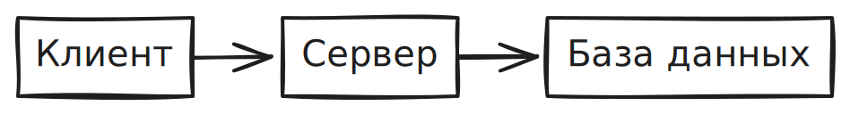
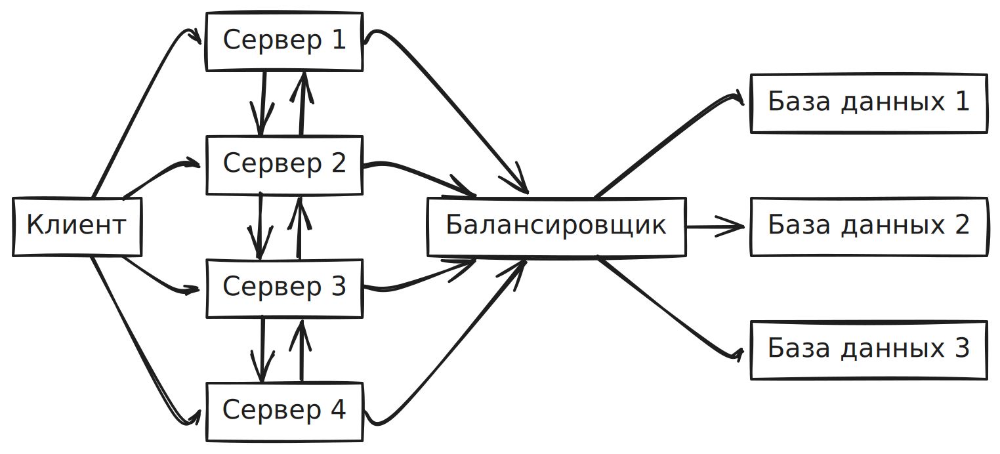

## Junior

### Теория тестирования

1. Что такое тестирование?
2. Зачем тестировать ПО?
3. Какие существуют этапы тестирования?
4. Какие типы тестирования можете назвать?
5. Какие уровни тестирования знаете?
6. Какие техники тест-дизайна знаете?
7. Что такое техника анализа классов эквивалентности?
8. Что такое техника анализа предельных значений? В чем ценность этой техники?
9. Что такое Regression и Confirmation тестирование, какая между ними разница?
10. Как часто следует проводить регрессионное тестирование продукта?
11. Какие бывают виды интеграционного тестирования?
12. Что такое Configuration Testing?
13. Что такое Exploratory Testing?
14. Какие существуют UI-стандарты?
15. Что такое Black/Grey/White Box Testing?
16. Что такое Performance Testing?
17. Что такое Smoke и Sanity тестирование и какая между ними разница?
18. Что такое Traceability Matrix?
19. Что такое Sanity Testing?
20. Что такое End-to-End тест?
21. Что такое тестирование безопасности?
22. Что такое испытание на основе рисков?
23. Что такое динамическое тестирование?
24. Что такое «парадокс пестицида»?
25. Опишите основные фазы STLC? Дайте определение Entry и Exit Criteria.
26. Что такое Bug, Error, Failure, Fault?
27. Какие есть атрибуты баг-репорта? Какие основные поля для заполнения?
28. Какова разница между приоритетом и серьезностью?
29. Приведите примеры серьезного, но не приоритетного бага.
30. В чем разница между валидацией и верификацией?
31. Зачем нужна тестовая документация? Какие её виды?
32. Что такое тест-план? Какие элементы у него есть?
33. Какую обязательную информацию должен содержать тест-план? Как правильно его использовать, поддерживать и нужен ли он вообще для большинства проектов?
34. Какая разница между чеклистом и тест-кейсами?
35. Приведите пример хорошего тест-кейса.

### Web

1. Что такое клиент-серверная архитектура?
2. Что может выступать в роли клиента?
3. Что такое REST API, SOAP? В чем разница?
4. Какие протоколы передачи данных знаете?
5. Какие способы взаимодействия с API существуют? В чем разница между ними?
6. Как можно протестировать API, что там нужно проверять?
7. Как расшифровывается CRUD?
8. Чем отличается GET от POST?
9. Какие отличия между XML и JSON?
10. Какие знаете форматы передачи данных?
11. Как происходит шифрование?
12. Какие бывают виды баз данных?
13. Охарактеризуйте каждый класс status code (1хх; 2xx; 3xx; 4xx; 5xx).
14. Какие есть HTTP-методы?
15. Какие знаете Web elements?
16. Какие браузеры знаете? В чем их отличие?
17. Какую структуру имеет веб-страница?
18. Зачем чистить кэш?
19. Для чего необходимы инструменты разработчика в браузере (Chrome DevTools) и как они помогают в тестировании.
20. Что такое кэш?
21. Что такое сессия?
22. Зачем нужны cookies?
23. Что такое фрейм?
24. Что такое HTML/CSS/JavaScript?
25. Какие виды тестирования можно применить только к Web?
26. Для чего в веб-страницах используют JavaScript?
27. Что такое REST?
28. Что такое AJAX?

### Mobile

1. Какие мобильные платформы существуют?
2. Какие версии Android и iOS используются на рынке (минимальные и максимальные)?
3. Какие версии Android нужно тестировать, если заказчик сказал поддерживать с версии 5.0?
4. Назовите типы мобильных приложений.
5. Каков формат файлов сборок приложений для Android и iOS?
6. Что такое ADB?
7. Как снять логи с AOS/IOS?
8. Что нужно проверять при использовании сканера отпечатка/Face ID?
9. Как я могу запускать тесты Android без Appium?
10. Объясните концепцию дизайна Appium.

### SQL

1. В чем разница между операторами DELETE и TRUNCATE?
2. В чем разница между командами DROP и TRUNCATE?
3. Из каких подмножеств состоит SQL?
4. Что подразумевается под СУБД? Какие существуют типы СУБД?
5. Что подразумевается под таблицей и полем в SQL?
6. Что такое соединения в SQL?
7. В чем разница между типом данных CHAR и VARCHAR в SQL?
8. Что такое первичный ключ (Primary key)?
9. Что такое ограничения (Constraints)?
10. В чем разница между SQL и MySQL?
11. Что такое внешний ключ (Foreign key)?
12. Что подразумевается под целостностью данных?
13. В чем разница между кластеризованным и некластеризованным индексами в SQL?
14. Напишите SQL-запрос для отображения текущей даты.
15. Что вы подразумеваете под денормализацией?
16. Что такое нормализация и каковы ее преимущества?
17. Объясните различные типы нормализации.
18. Что такое индекс?
19. Опишите различные типы индексов.
20. Что такое свойство ACID в базе данных?
21. Что вы подразумеваете под «триггером» в SQL?
22. Какие операторы доступны в SQL?
23. Совпадают ли значения NULL со значениями нуля или пробела?
24. Что такое подзапрос в SQL?
25. Какие бывают типы подзапросов?
26. Перечислите способы получить количество записей в таблице?

!!! note ""
	Ответы на вопросы: [https://habr.com/ru/company/otus/blog/461067/](https://habr.com/ru/company/otus/blog/461067/)
	
	Дополнительные вопросы и ответы на английском языке: [https://www.edureka.co/blog/interview-questions/sql-interview-questions](https://www.edureka.co/blog/interview-questions/sql-interview-questions)

### Практические задания

1. Написать чеклист для функционала корзины в интернет-магазине.
2. Написать тестовые наборы данных для поля ввода даты, которое отсеивает пользователей в возрасте до 18 лет.
3. Написать чеклист тестирования формы ввода данных платежной карты.
4. Протестовать «предмет» относительно различных видов тестирования. (Предмет - лифт, карандаш, калькулятор и т. д.)
5. Есть Input поле, принимающее целые значения от 18 до 99 включительно. Надо протестировать с помощью техники тест-дизайна Boundary Values ​​Analysis и Equivalence Partitioning.
6. Есть веб-страница с полями: e-mail, password и кнопкой submit. Необходимо привести примеры отрицательных тест-кейсов, которыми можно проверить эту страницу.
7. Привести примеры тест-кейсов для функционала, находящегося на нескольких страницах проекта (например, поле поиска).
8. Как протестировать процесс оплаты в интернет-магазине?
9. Как протестировать сломанный тостер?
10. Объясните для 7-летнего ребенка, что такое база данных.
11. Определите необходимое количество функциональных тест-кейсов, чтобы проверить Login форму.
12. Есть форма регистрации в веб-приложении с полями (first name, last name, username, password, repeat password) и кнопкой Register. Какие проверки нужно провести?
13. Поле username должно быть обязательным, но оно не является обязательным. Приведите пример баг-репорта, созданного для этой ошибки.
14. Как бы вы провели smoke-testing для приложения типа Telegram?
15. Как будет выглядеть баг-репорт, если, к примеру, не работает электрический чайник?
16. Есть таблица books с полями: name, price, page_count. Следует выбрать все имена книг, в которых price более 10 единиц и количество страниц от 20 до 100.
17. У вас есть функционал калькулятора, который доступен через веб-браузер по ссылке. Он имеет только функцию делить, так сказать, MVP-версию. Диапазоны для вписывания в числитель и делитель от 0,1 до 99,9. Вывод значения происходит автоматически, потому что front-end реализован на React JS. Как вы будете тестировать этот функционал? Какие виды тестирования примените? Какие техники тест-дизайна используете?

	{width=300}
/// caption
///

18. Задание на работу с SQL.
	Есть таблица:
	```sql
	Customers: ID, Name
	Orders: ID, Customer_ID
	```

	Нужно написать запрос что бы он вывел на экран пары – Имя кастомера и количество ордеров которое на него есть в таблице Customers.
	Попробовать создание таблиц, заполнение данными, ALTER, DROP, TRUNCATE, первичные, вторичные ключи и CONSTRAINT на таблицах.

	[https://sqliteonline.com/](https://sqliteonline.com/)
	
	```sql
	CREATE TABLE Customers (
	    ID int,
	    name varchar(255)
	);
	
	CREATE TABLE Orders (
	    ID int,
	    Customer_ID int
	);
	
	INSERT INTO Customers (
	  id,
	  name
	)
	VALUES 
	(1, "Apple"),
	(2, "Google"),
	(3, "Amazon"),
	(4, "Microsoft");
	  
	INSERT INTO Orders (
	  id,
	  customer_id
	)
	VALUES 
	(1, 1),
	(2, 1),
	(3, 2),
	(4, 3);
	  
	SELECT c.name as company_name, COUNT(o.ID) as number_of_orders FROM Customers c
	LEFT JOIN Orders o
	ON c.ID = o.Customer_ID
	GROUP BY c.ID
	ORDer BY COUNT(o.ID) DESC
	
	```
	
	Нужно:
	1. Извлечь номер телефона и адрес пользователя Muzik.
	2. Извлечь данные о пользователях, имеющих сумму заказа более 2000 рублей.
	3. Подсчитать количество заказов в таблице и общую сумму сделанных заказов.
	
	Таблица USER
	
	| id  | name  | phone | delivery adderss |
	| --- | ----- | ----- | ---------------- |
	| 0   | Kolya | 111   | Moscow           |
	| 1   | Petya | 222   | Saint-Petersburg |
	| 2   | Sasha | 333   | Yekaterinburg    |
	| 3   | Muzik | 444   | Chelyabinsk      |
	
	Таблица ORDER
	
	| id  | user_id | from_user | sum   |
	| --- | ------- | --------- | ----- |
	| 123 | 0       | Kolya     | 1000  |
	| 234 | 1       | Petya     | 20000 |
	| 345 | 2       | Sasha     | 2500  |
	| 456 | 3       | Muzik     | 4520  |


19. Ваша компания разрабатывает программное обеспечение для медицинских систем, и вы тестируете компонент, управляющий дефибриллятором сердца. Вы заметили, что одно решение в тестовом модуле состоит из 34 независимых атомарных условий. Какой метод тестирования белого ящика следует выбрать для этого и почему?
20. Оздоровительная программа для сотрудников совмещена с оплатой медицинского страхования и имеет следующие правила:
	1. сотрудники, потребляющие 17 единиц или менее алкоголя в неделю, получают $28 скидки на оплату.
	2. Для сотрудников, которые заполнят «Оценку риска для здоровья», оплата уменьшается на $23.
	3. Сотрудники, участвующие в ежегодном контроле за состоянием здоровья в компании: получат скидку на $50 за то, что имеют индекс массы тела (ИМТ) 25,5 или менее, и $19 скидки при ИМТ ниже 30. Некурящие получают дополнительную скидку на $46. Курильщики, присоединившиеся к курсу отказа от курения, получают скидку в $24. Курильщики, не присоединившиеся к курсу отказа от курения, оплачивают дополнительно $75.
	
	Используя технику классов эквивалентности, сколько тестов нужно написать, чтобы покрыть вышеупомянутые условия на 100%?
	
21. Какое минимальное количество тестов необходимо для покрытия следующих условий автогражданки:
	1. лица до 18 лет не застраховываются.
	2. Для мужчин на красном авто прибавляется +15% к стоимости полиса.
	3. Для женщин от 18 до 64 лет страховая премия 1000 рублей.
	4. Для мужчин от 18 до 64 лет страховая премия 1200 рублей.
	5. Для лиц старше 64 лет страховая премия 1800 рублей.

22. Напишите сценарии автоматического тестирования для сортировки по цене и добавлению товара в корзину на [сайте](https://www.saucedemo.com/). К вашим тестам добавьте документацию с настройками и разместите ваше решение на GitHub.

### AQA

#### Программирование

1. Что такое ООП? Назовите ли его принципы с примерами?
2. Что такое интерфейс? Что такое абстрактный класс? Чем они отличаются?
3. Что такое SOLID? Приведите примеры.
4. Что такое DRY, KISS, YAGNI?
5. Какие паттерны GOF вам известны? Приведите примеры их использования.
6. Что такое PageObject и PageFactory?
7. Какова иерархия Collections?
8. Какая разница между Thread class и Runnable interface?
9. Какая разница между String, Stringbuffer и Stringbuilder?
10. Разница между final, finally и finalize?

#### Selenium

1. Что такое Selenium и зачем его используют?
2. Что такое драйвер браузера?
3. Какие виды локаторов страницы есть? Каковы их преимущества и недостатки?
4. Что такое Selenium Waits? Какие есть и чем отличаются?
5. Какие exceptions может оставить Selenium? Что они значат и как их обрабатывать?
6. Для чего используют JavaScriptExecutor? Приведите примеры.
7. Что такое Selenium Grid?
8. Какие способы click и send keys в Selenium?
9. Как вы запускаете параллельное выполнение тестов? Что такое ThreadLocal?
10. Какая разница между Action и Actions?
11. Как написать способ isElementPresent?
12. Как вычитать данные из динамической вебтаблицы?
13. Можете ли вы назвать 10 интерфейсов в Selenium?
14. Назовите два способа автоматизации капчи.
15. Вспомните типы навигационных команд Selenium.
16. Как найти поврежденные ссылки в Selenium WebDriver?
17. Какую технику следует применить, если «нет ни frame id, ни frame name»?

#### TestNG/JUnit

1. Зачем нужны TestNG/JUnit?
2. Какие инструкции используются в TestNG/JUnit?
3. Какие assertions есть в TestNG/JUnit?
4. Как выполнять тесты параллельно TestNG/JUnit?

#### Git

1. Для чего используют системы контроля версий?
2. Что такое Git? Каков принцип его работы?
3. Что такое commits, branches в Git?
4. Для чего нужны GitHub, GitLab и т.д.?

#### CI

1. Что такое CI?
2. Как интегрируется автоматическое тестирование в CI?
3. Как настроить Job или Pipeline на знакомом вам CI-инструменте?
4. Какие инструменты для создания репорта после выполнения автоматических тестов вы знаете?
5. Какую информацию должен содержать отчет о выполнении автоматических тестов?

## Middle

### Теория

1. Назовите обязанности QA?
2. Что знаете о тестировании нагрузки? В каком случае следует проводить такое тестирование? На каком этапе готовности продукта?
3. Что такое таблица решений/decision table и как её можно использовать?
4. Что может быть критериями запуска и завершения тестирования?
5. Расскажите о вариантах интегрирования тестовой документации в проект, инструментах для работы с ней.
6. Как организовать сквозное тестирование (e2e)?
7. Какие тест-кейсы можно создать для тестирования баз данных?
8. Приведите примеры подходов для тестирования локализации.
9. Что такое A/B тестирование?
10. Что такое mock/stub? Какие знаете инструменты для работы с ними?
11. Когда нужно использовать технику Pairwise?
12. Что такое fuzz-тестирование и где его используют?
13. Что такое REgexp?
14. Как меняется стоимость дефекта при тестировании программного обеспечения?
15. Каковы пути анализа бизнеса клиента? Как определить целесообразность того или иного функционала?
16. Назовите последовательность выполнения CI/CD процесса на проекте.
17. Какое должно быть процентное соотношение между положительным и отрицательным тестированием на проекте?
18. Какой вид тестирования целесообразнее проводить до релиза?
19. Есть ли разница между bug leakage и bug release?
20. Может ли быть ситуация, когда критерии завершения (exit criteria) не выполнены? Что должно происходить в этом случае?
21. Что мы действительно должны покрывать тест-кейсами, а что считается избыточным расходом времени и денег? Когда нецелесообразно писать тест-кейсы?
22. Для какого функционала труднее всего написать тест-кейсы?
23. Как посчитать Cyclomatic complexity?
24. В чем основная разница между defect detection percentage и defect removal efficiency?
25. Какие модели risk-based testing вы знаете?
26. Что такое тестирование API? Какими инструментами пользуются для его выполнения?
27. Что такое performance testing? Какими инструментами пользуются для его выполнения?
28. Что такое load и stress testing? Какими инструментами пользуются для их выполнения?
29. Что такое contract testing?
30. Какая разница между Scrum и Kanban?
31. Расскажите о ритуалах, ценностях и ролях в Scrum.
32. Как выбор методологии может повлиять на качество разработки?
33. Нулевой спринт в Scrum. Для тестирования есть задание под названием «Настройка среды». Что здесь нужно выполнять?

### Тестовая инфраструктура

1. Что такое и чем отличаются виртуальная машина, симулятор и эмулятор?
2. Что такое контейнер и чем он отличается от виртуальной машины?
3. Как используют виртуальные машины и контейнеры в автоматизации?
4. ​​Что такое IaaS и PaaS? Приведите примеры.
5. Что такое Configuration Management?
6. Что такое Provisioning?
7. Какие команды Linux Shell вам известны? Как с помощью команд Linux Shell найти лог-файл и строчку с ошибкой в ​​файле?
8. Какие команды Windows CMD вам известны? Как с помощью команд Windows CMD найти IP-адрес машины?
9. Что такое SSH и как им пользоваться?
10. Что такое bash и batch скрипты? Зачем их используют?

### Web

1. Какая разница между авторизацией и аутентификацией?
2. Как происходит авторизация на сервере?
3. Какие статус-коды ошибок бывают? Может ли сервер отправить код 400, если проблема на его стороне?
4. Как выполнить Debug страницы в браузере?
5. Как протестировать адаптивную верстку?
6. Что такое WebSocket и как проверить обрыв соединения?
7. Каковы есть основные виды уязвимости веб-приложений?
8. Какие инструменты для тестирования Web performance client-side знаете?
9. Какова разница между методами GET и POST?
10. Какая разница между методами PUT и PATCH?
11. Какие знаете сниферы?
12. Какова разница между DROP и TRUNCATE?
13. Что такое case function?
14. Что такое collation?
15. Что такое схема GraphQL?
16. Объясните разницу между OLTP и OLAP.
17. Вспомните разные типы репликации в SQL Server?
18. Что вы понимаете под Self Join? Приведите примеры.
19. Что такое cursor и как им пользоваться?

### Mobile

1. Что основное нужно проверить при тестировании мобильного приложения?
2. Что такое Manifest.xml в .apk файле и какие данные там указывают?
3. Что такое режим разработчика Do not keep activities?
4. Как происходит перехват трафика http/https для мобильных устройств?
5. В каком виде хранятся данные в мобильных приложениях локально?
6. Как тестировать миграцию локальных данных?
7. Каковы основные компоненты Android-приложений (активити / фрагмент / сервис / интент-фильтр)?
8. Опишите жизненный цикл активити.
9. Что такое утечки памяти? Как найти?
10. Как протестировать билд на Android?
11. Что такое Testflight? Как тестировать с его помощью?
12. Как работает Android? Какая у него архитектура?
13. Как происходит деплой программ IOS/AOS?

### Практические задания

1. Что делать, если разработчик не соглашается, что указанный баг действительно является багом? А если в требованиях использована неоднозначная формулировка? Если бизнес-аналитик, PM и представитель клиента сейчас недоступны, чтобы подсказать? Как можно предотвратить такую ​​ситуацию?
2. Сложилась ситуация, когда команда тестирования не успевает закончить свою работу в дедлайн. Как правильно действовать в этом случае? А если релиз передвинуть нельзя? А если никакие фичи из релиза забрать нельзя?
3. Что делать, если проект уже начался, а QA-инженер там начал работать только когда начали разрабатываться бизнес-фичи? Какие этапы тестирования теперь нужно наверстать и нужно ли это? Как это сделать максимально грамотно без ущерба для загрузки по тестированию новых фич? Какие риски имеет позднее вовлечение QA-инженера в разработку?
4. Веб-страница с полями e-mail, password и кнопкой submit. Назовите отрицательные тест-кейсы, по которым можно проверить эту страницу.
5. Предположим, что после нажатия кнопки submit страница перезагружается и ранее введенные данные исчезают. Как проверить, что информация отправлена ​​в базу данных?
6. Как проверить, что данные отправились на сервер, если у нас нет доступа к бэкенду?
7. Приведите примеры улучшений для приведенной веб-страницы (любая на выбор).
8. Составить Smoke Test Suite для e1.ru.
9. Протестовать функционал банкомата с помощью техники State Transition Diagram.
10. Написать предельные значения для ввода в форму оплаты товара на сайте.
11. Есть метод POST, который регистрирует нового пользователя на сайте, есть тело запроса, содержащее данные о почте, телефоне, имени пользователя и адресе проживания. Какие кейсы для проверки можете привести?
12. На что следует акцентировать внимание при автоматизации методов API? Что следует проверять?
13. Вы тестируете логин-форму, вводите логин и пароль, нажимаете кнопку логин и ничего не происходит. Ваши действия?
14. В течение 5 минут найдите и опишите дефекты, которые вы видите:
		
15. Вам нужно сделать Regression Testing за два дня. Как вы это сделаете, если Regression Run охватывает 1000 тест-кейсов?
16. Вы тестируете интернет-магазин, который продаёт карандаши. В заказе нужно указать количество карандашей (максимум для заказа – 1000 штук). В зависимости от заказанного количества карандашей отличается цена:
	1. 1–100 – 10 рублей за шт.
	2. 101-200 – 9 рублей за шт.
	3. 201-300 – 8 рублей за шт.

	С каждой новой сотней цена уменьшается на 1 рубль.
	Задание: используя тест-дизайн, опишите все необходимые тест-кейсы, которые будут максимально покрывать описанную функциональность.

17. Есть приложение типа мессенджера, пользователь заходит в чат и отсылает файл (видит сообщение Failed to send...) Когда это может быть баг, а когда нет?
18. Есть веб-приложение интернет-магазина (регистрация, логин, поиск товаров, корзина и покупки). Программу поддерживают следующие браузеры: Chrome, Safari, Edge. У нас есть ограниченное время на тестирование. Расскажите, как вы будете проверять приложение?
19. Напишите автоматические тестовые сценарии для проверки API операций создания и просмотра [GitHub Gists](https://docs.github.com/en/rest/reference/gists). Интегрируйте ваш проект с известной вам CI-системой.

### AQA

#### Selenium

1. Расскажите, как вы будете строить и внедрять стратегию автоматизации тестирования.
2. Как взаимодействуют клиентская библиотека Selenium, драйвер браузера и сам браузер?
3. Для чего используют browser capabilities, arguments и options?
4. Что такое iframe и как с ним работать в Selenium?
5. Как обрабатывать браузерные сообщения (alerts)?
6. Что такое Appium?
7. Что такое Electron-based applications? Как использовать Selenium и Appium для их тестирования?
8. Как взаимодействовать с запросами, отправляемыми из браузера.
9. Как взаимодействовать с cookies, LocalStorage и SessionStorage?

## Senior

### Теория

1. Как вы преодолеете трудности из-за отсутствия надлежащей документации для тестирования?
2. Какой подход является наилучшим для старта QA в проекте?
3. Какие препятствия могут возникнуть в обеспечении качества для Agile Tester?
4. Что такое Definition of Done?
5. Когда можно считать, что тестирование окончено?
6. Что такое RCA в тестировании? Нужно ли его проводить?
7. Какой подход вы используете для Test Cases Review?
8. Какие виды рисков существуют? Что такое Mitigation Plan?
9. На основе чего нужно составлять стратегию для проведения тестирования нагрузки?
10. Как часто следует ревьюировать тестовую документацию?
11. Как можно быстро сделать выборку необходимых проверок для смоук-тестирования?
12. Как запланировать загруженность команды тестировщиков?
13. Какую ценность несет анализ результатов тестирования команде и проекту в целом?
14. Как можно подкорректировать флоу разработки, чтобы получать более чистые результаты на выходе и уменьшить количество багов на проде?
15. Расскажите о метриках качества, которые вы применяли. Зачем они нужны?
16. Как провести эстимейт задачи? Каковы техники оценки объема тестирования существуют?
17. Как можно посчитать покрытие тестами функционала?
18. Какое оптимальное количество шагов в тестовом сценарии?
19. Как избежать появления регрессивных дефектов?
20. Что такое тестирование со смещением влево (Shift left testing)?
21. Как будете тестировать программу, если для продукта нет документации?

	| Критерий                            | Black Box                                                                                                                        | White Box                                                                       |
	| ----------------------------------- | -------------------------------------------------------------------------------------------------------------------------------- | ------------------------------------------------------------------------------- |
	| Определение                         | тестирование, как функциональное, так и нефункциональное, не предполагающее знания внутреннего устройства компонента или системы | тестирование, основанное на анализе внутренней структуры компонента или системы |
	| Уровни, к которым применима техника | В основном:<br>- приемочное тестирование<br>- системное тестирование                                                             | В основном:<br>- юнит-тестирование<br>- интеграционное тестирование             |
	| Кто выполняет                       | Как правило, тестировщик                                                                                                         | Как правило, разработчики                                                       |
	| Знания программирования             | Не нужно                                                                                                                         | Необходимо                                                                      |
	| Знание реализации                   | Не нужно                                                                                                                         | Необходимо                                                                      |
	| Основа для тест-кейсов              | Спецификация, требования                                                                                                         | Проектная документация                                                          |

22. В чем смысл юнит-тестов?
23. Какие минусы полной автоматизации тестирования?
24. Что такое ROI и как его считать?
25. Что такое CI/CD? Какие плюсы и минусы этого подхода?
26. TOP OWASP: какие знаете уязвимости и методы защиты?
27. Что вы думаете по поводу BDD? Когда следует использовать, а когда будет только хуже? Если все же следует использовать, то для UI или API автоматизированного тестирования?
28. Что такое сокеты и как их тестировать, вручную и автоматизировано? Зачем их используют?
29. Когда следует делать стресс-тестирование на проектах? От чего отталкиваться, когда строите сценарий для такого тестирования? Что учесть при выборе инструмента?
30. Расскажите об алгоритмах шифрования трафика.
31. Что такое NIC?
32. Для чего нужен протокол RTP?
33. Что, по вашему мнению, лучше – SIP или PRI?
34. Что такое NAT?

### Практические задания

1. Сформулируйте негативные сценарии для POST-запроса, создающего нового пользователя.
2. Как вы регулируете конфликтные ситуации между QA и разработчиками?
3. Есть проект, на котором нет тестовой документации, но проекту уже год. Мануальным QA не хватает времени на тестирование, они очень устали, есть желание уволиться. Какое решение по команде можно принять?
4. Продайте мне тестирование как клиенту, не желающему его покупать. Кратко и структурированно опишите вашу работу на каждом из этапов разработки ПО, используя профессиональные термины (не лить воду).
5. У вас есть онлайн-калькулятор. Вы вводите 1+1 и получаете 3. Расскажите, как вы будете искать причину проблемы.
6. Есть веб-страница с полями e-mail, password и кнопкой submit. Предположим, что после нажатия кнопки submit страница перезагружается и ранее введенные данные исчезают. Как проверить, что данные отправлены в базу данных?
7. Какое минимальное количество тест-кейсов необходимо, чтобы убедиться в корректной работе этой веб-страницы (по выбору)?
8. Как проверить безопасность на веб-странице (по выбору)?
9. Могут быть такие виды архитектур? Что может быть недостаточно для правильной работы архитектур, приведенных ниже?
   
{width=500}
/// caption
Пример 1
///

{width=500}
/// caption
Пример 2
///

{width=500}
/// caption
Пример 3
///

{width=500}
/// caption
Пример 4
///

- Какие запросы выполняются по форме авторизации?
- Какой запрос выполняется при сохранении данных в базе данных?
- Можно ли авторизироваться с помощью GET-запроса и нормально ли так поступать?
- Какой код ответа мы получаем при падении ошибки на сервере, код при ошибочных credentials на форме авторизации?
- Можно ли заменить SSL-сертификат шифрованием данных в пакете от клиента к серверу для протокола HTTP и будет ли это равноценной заменой?


