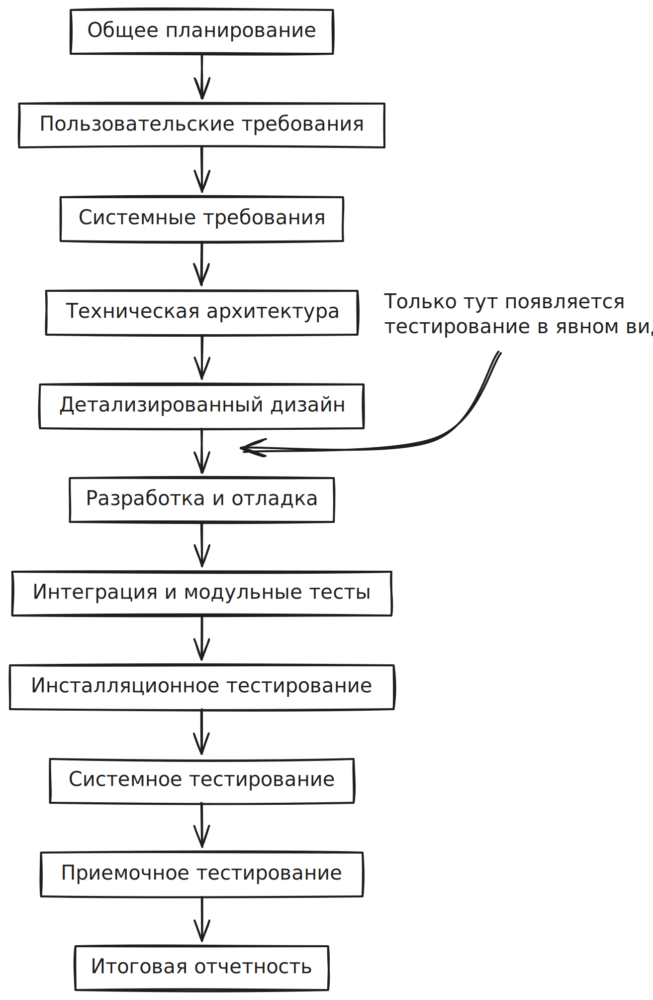
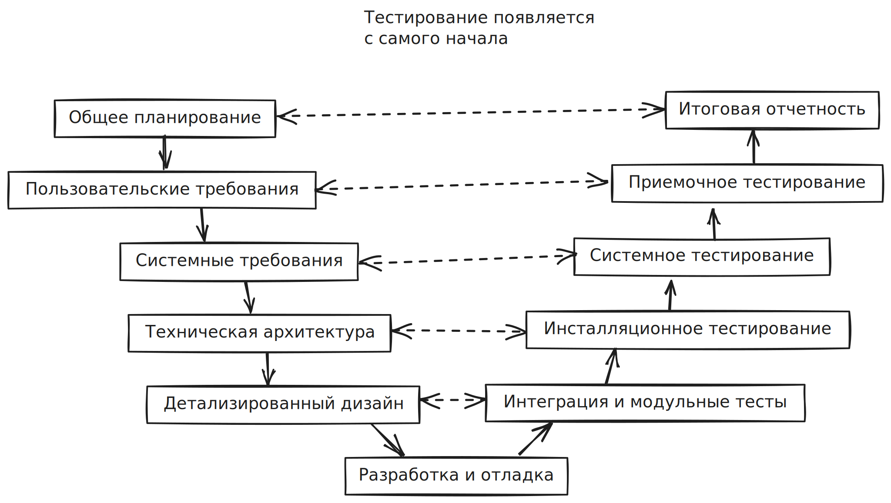
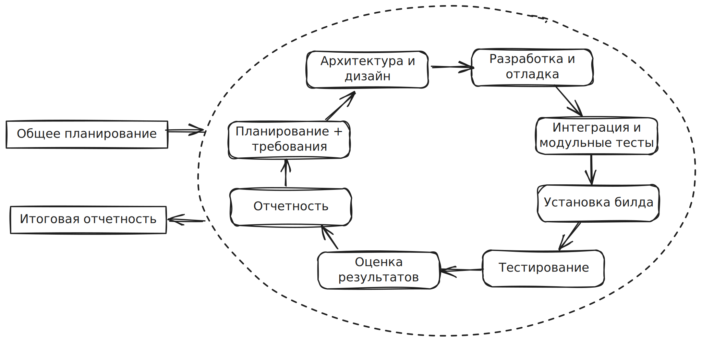
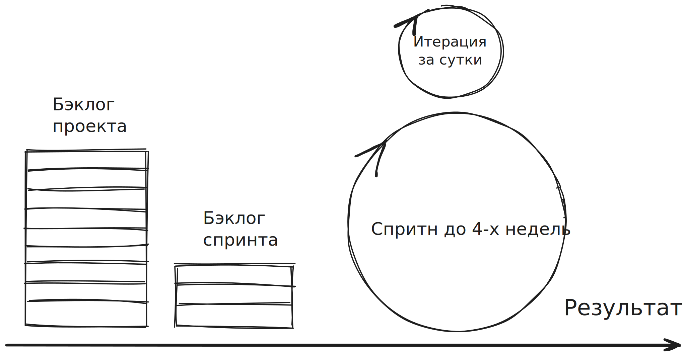

## Водопадная модель

Этапы разработки идут последовательно друг за другом. Тестирование как деятельность появляется где-то с середины жизненного цикла.

В идеале между каждыми этапами существуют некоторые приемочные испытания или проверки, но это редко встречается.

Ошибки на предыдущих этапах часто накапливаются и не исправляются. Их стараются исправить или даже сгладить на следующих этапах разработки.
Такая модель подходит для тяжелых, больших, неповоротливых, хорошо задокументированных проектов:

- аэрокосмическая отрасль
- медичинская отрасль

{width=400}
/// caption
///

## V-образная модель

Взяли все те же самые этапы разработки из водопадной модели, но согнули в букву V.
Каждому текущему этапу разработки соответствует некий этап в будущем.

При работе с текущим этапом мы как бы заглядываем в будущее и стараемся ответить на вопрос "какие проблемы могут возникнуть на этапе в будущем?".

В этой модели тестирование стало появляться между этапами разработки. 

Эта модель подходит для не очень длинных проектов. Потому что при коротких проектах мы еще как то можем предположить какие проблемы возникнут в будущем, но если проект длится годами, то, например, на этапе общего планирования сложно определить проблемы, которые возникнут на этапе итоговой отчетности.

## Итерационная модель

В этой модели этапы разработки закольцованы и выполняются снова и снова. 
Кроме того, что для тестирования есть отдельные этапы, эта модель подразумевает тестирование не между этапами разработки, а тестирование включено во все этапы, что положительно влияет на качество.

У модели есть большой минус в виде большого количество бюрократии, так как модель ориентирована на большие проекты с большим количеством участников.

## Гибкая модель (Agile)

Эта модель рассчитана 5-8 человек.
У нас есть некий проектный бэклог (список требований, задач), из него мы выбираем подмножество задач или ==бэклог спринта==. Далее этот бэклог спринта замораживается на 2-4 недели. Это длительность спринта. Затем каждый день происходит итерация. По окончанию спринта мы получаем некий результат, который можно показать заказчику. Новая функциональность, исправление багов и так далее.

Модель подразумевает, что команда находится в одном месте и постоянно взаимодействует друг с другом. Следовательно это позволяет сэкономить на бюрократической волоките. Т.е. каждый член команды знает все о разрабатываемом продукте.

Такая модель избавляет от недостатка итерационной модели, но не позволяет работать большой команде над проектом.

 Тестирование в данной модели находится везде. Все этапы разработки в данной модели пропитаны тестированием, можно даже сказать подчинены тестированию.

С каждой итерацией на выходе получается все более качественный проект.
