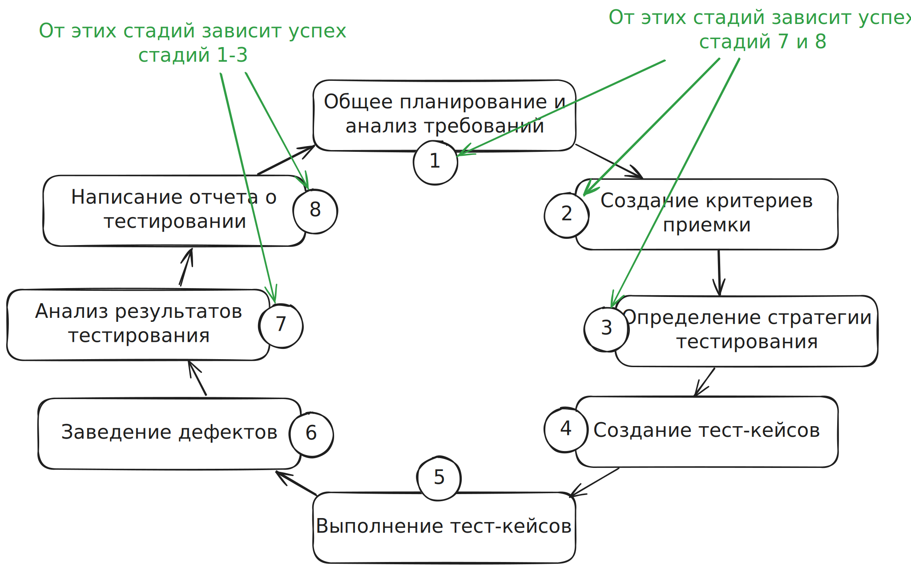

1. Общее планирование и анализ требований
	1. Что тестировать? ==Понять== что именно предстоит тестировать.
	2. Сколько предстоит работы?
	3. Какие сложности могут возникнуть во время тестирования?  Как предотвратить эти сложности?
	4. Какие у нас есть ресурсы для тестирования?  Если ресурсов нет, то где и как их получить?
	5. Все ли в порядке с требованиями?
2. Создание критериев приемки
	1. Создание метрик, по которым будет оцениваться тестирование
	2. Определение критериев для запуска, паузы, возобновления и остановки тестирования
	3. Определение критериев для оценки качества продукта. Как будем оценивать себя в будущем?
	4. Установка целей тестирования для текущего цикла
3. Определение стратегии тестирования
	1. Думаем ==КАК== достичь целей и критериев тестирования, определенных на шаге 2.
	2. Выбирается подход к тестированию
	3. Выбор инструментов тестирования
	4. Составляется расписание
	5. Задаются роли
	6. Распределяется ответственность
4. Создание тест-кейсов
	1. Создание чек-листов
	2. Создание тест-кейсов
	3. Определение тест-кейсов в тестовые наборы
5. Выполнение тест-кейсов
6. Заведение дефектов во время выполнения шага 5
7. Анализ результатов тестирования
	1. Удалось ли достичь целей поставленных в 1-3 шагах
8. Написание отчета о тестировании
	1. Пишем отчет по результатам анализа. Этот отчет будет основой для планирования следующей итерации тестирования.

!!! note ""

	От 1-3 стадий зависит успех 7 и 8, а от 7 и 8 зависит успех 1-3 стадий.