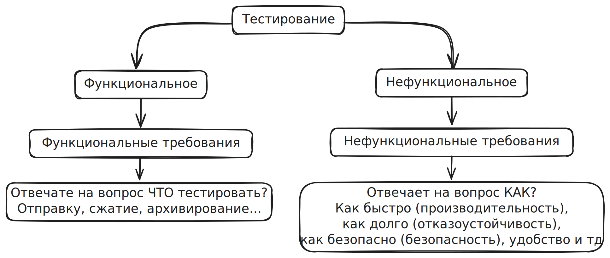
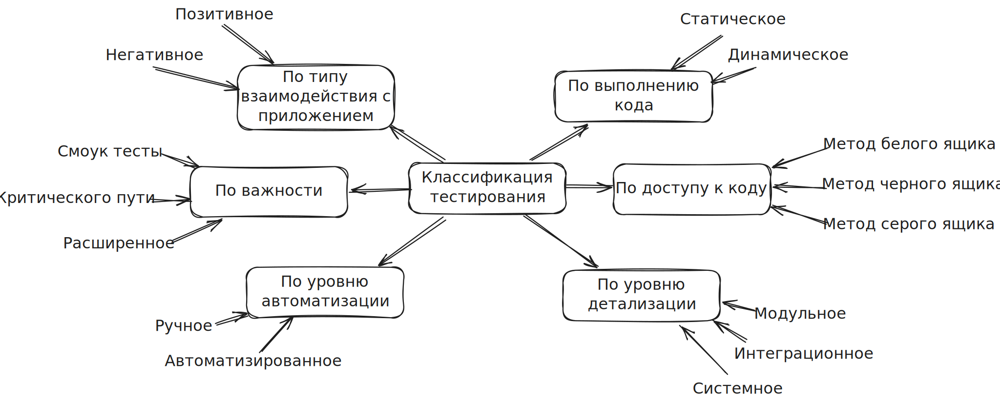
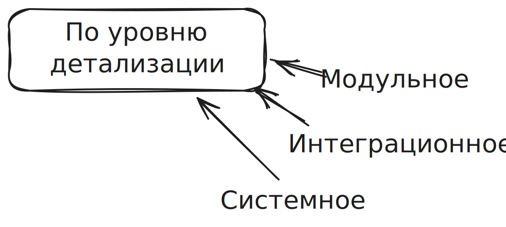
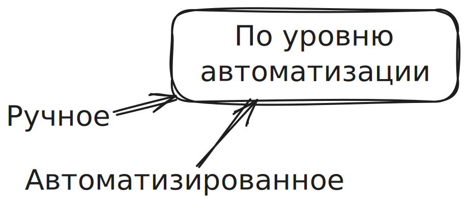
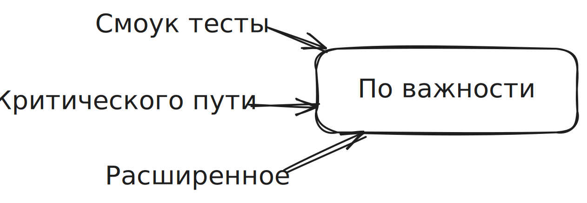
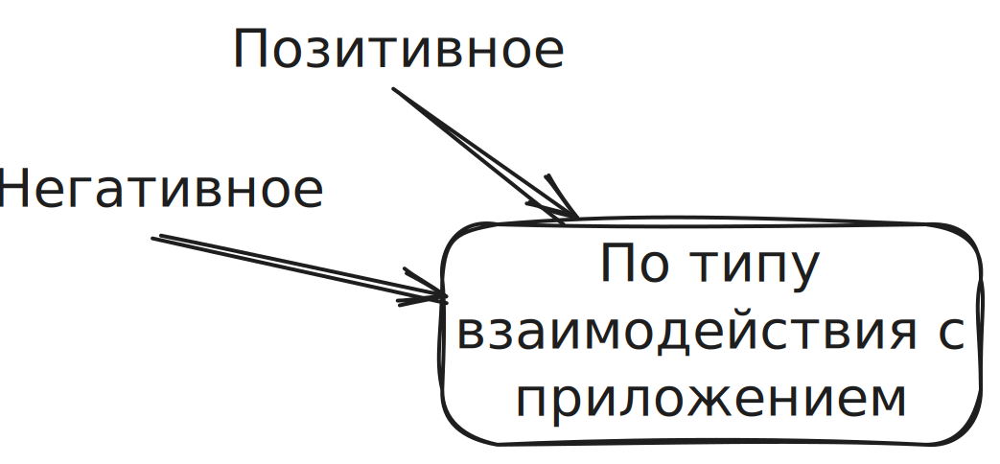

**Функциональное тестирование** – тестирование, которое проводится для оценки соответствия продукта функциональным требованиям.

**Функциональные требования** – требования, которые определяют какими функциями должен обладать продукт.

**Нефункциональное тестирование** – тестирование, которое проводится для оценки соответствия продукта нефункциональным требованиям.

**Нефункциональные требования** – требования, которые определяют как продукт должен делать то для чего он задуман.

## Упрощенная схема классификации тестирования

### По выполнению кода

**Статическое тестирование** – тестирование продукта без запуска кода (без запуска самого приложения).
Сюда можно отнести тестирование документации, код ревью.

**Динамическое тестирование** – тестирование продукта с запуском кода (запуск приложения).
Большая часть работы тестировщик относится именно к динамическому тестированию.

### По доступу к коду

**Тестирование методом белого ящика** – тестирование основанное на анализе внутренней структуры продукта.
У нас есть доступ к коду, у нас есть знания, чтобы понять что написано в коде.

**Тестирование методом черного ящика** – тестирование основанное на анализе спецификации продукта.
Если нет доступа к коду или нет знаний для того, чтобы понять код. Или мы специально не хотим использовать код и/или знания.

**Тестирование методом серого ящика** – комбинация методов белого и черного ящиков.
Часть системы доступна доступна и с ней мы работаем по методу белого ящика, а другая часть системы недоступна и мы работаем с ней по методу черного ящика.

### По уровню детализации

**Модульное тестирование (юнит тестирование, компонентное тестирование)** – тестирование отдельных модулей/компонентов продукта.

**Интеграционное тестирование** – тестирование взаимодействия модулей/компонентов продукта.

**Системное тестирование** – тестирование соответствия всей системы определенным требованиям.

Если дефект найден на уровне модуля, это точно означает что будет проблема на интеграционном уровне.

Если дефектов на модульном уровне нет, это не означает что не будет дефектов на интеграционном уровне.

То же самое и с интеграционным и системным уровнями:

Если найден дефект на интеграционном уровне, то дефект будет проявляться и на системном уровне.

Если дефектов на интеграционном уровне не найдено, это не означает, что не будет дефектов на системном уровне.

### По уровню автоматизации

**Ручное тестирование** – тестирование, при котором всей действия над ПО выполняет человек вручную.

**Автоматизированное тестирование** – тестирование, при котором используется специальное ПО, которое контролирует выполнение тестов, сравнивает фактический и ожидаемый результат, создает отчеты.

### По важности

**Смоук-тесты** – набор тестов, которые покрывают самый важный функционал продукта.

Смоук-тесты проводятся после релиза, чтобы проверить самые важные функции, без которых продукт не имеет смысла. Приведу приме с мобильным телефоном, он должен включаться, у него должен работать экран, динамик, микрофон, находиться сеть и прочее.

**Тестирование критического пути** – набор тест-кейсов, который покрывает функциональность, которую используют большинство пользователей большую часть времени. 

Это тоже важные тест, но не столько критические как смуок-тесты. Например, функция автоматического перехода мобильного телефона в режим не беспокоить. Этот функционал может быть важен для многих людей, но без этой функции телефон будет работать.

**Расширенное тестирование** – набор тест-кейсов, который покрывает "почему бы и нет?" функциональность. Большую часть времени этот функционал не используется пользователями.

Если этого функционала не будет в продукте, то пользователи все равно не откажутся от продукта. В большинстве продуктов расширенного тестирования вообще нет.

Например, в мобильном телефоне можно ввести дату рождения. В день рождения будет появляться иконка с ромашкой и будет махать лепестками.

Важность определяет заказчик. Если функция с ромашкой является важной для успеха продукта, то такая функция попадает в смоук-тесты.

### По типу взаимодействия с приложением

**Позитивное тестирование** – тестирование, при котором продукт проверяется на правильных входных данных и при правильных действиях.

**Негативное тестирование** – тестирование, цель которого показать, что ПО не работает. Выполняются неправильные действия, вводятся неправильные данные и прочее.

И в позитивных и в негативных тестах ожидаемый результат должен быть корректным поведением системы.