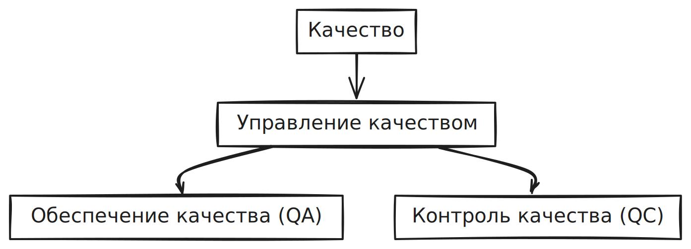
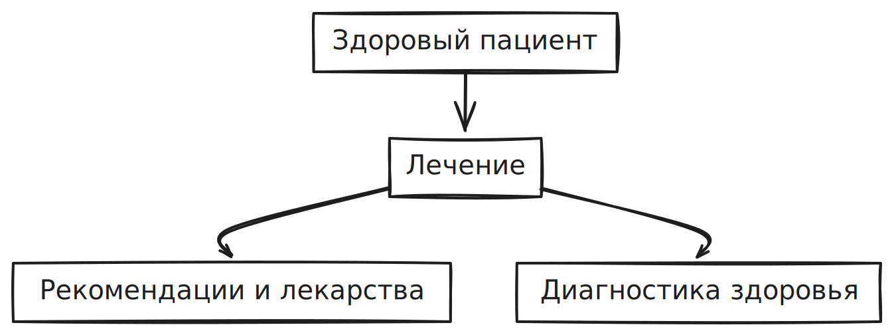

## Что такое качество?

### Аналогия с поликлиникой

- качество = здоровый пациент
- управление качеством = лечение
- обеспечение качества = рекомендации и лекарства
- контроль качества = диагностика здоровья пациента

## Определения

Тестирование включает в себя все:

- качество
- менеджмент качества
- обеспечение качества
- контроль качества

**Тестирование** – процесс в рамках жизненного цикла разработки программного обеспечения, который оценивает качество компонента или системы, а также связанных с ними рабочих продуктов.

**Качество** – степень, в которой продукт или услуга удовлетворяет заявленным и подразумеваемым требованиям.

**Управление качеством** – Скоординированные действия по руководству и контролю организации в отношении качества, которые включают в себя установление политики качества и целей качества, планирование качества, контроль качества, обеспечение качества и повышение качества.

**Обеспечение качества** – Активности, направленные на обеспечение уверенности в том, что требования к качеству будут выполнены.

**Контроль качества** – Набор действий, предназначенных для оценивания качества компонента или системы.

**Дефект** – Недостаток рабочего продукта, проявляющийся в несоответствии​ требованиям или спецификациям и ухудшающий целевое использование этого продукта.

**Ожидаемый результат** – Прогнозируемое наблюдаемое поведение компонента или системы при конкретных условиях, основанных на спецификации или другом источнике.

**Фактический результат** – Наблюдаемое или генерируемое поведение компонента или системы во время тестирования.

**Чек-лиск** – набор идей.

**Тест-кейс (тестовый сценарий)** – Набор предусловий, входных данных, действий (где применимо), ожидаемых результатов и постусловий, разработанных на основе тестовых условий.

**Тест-сьют (набор тестов)** – Набор тестовых сценариев или тестовых процедур, выполняемых в определенном тестовом прогоне.