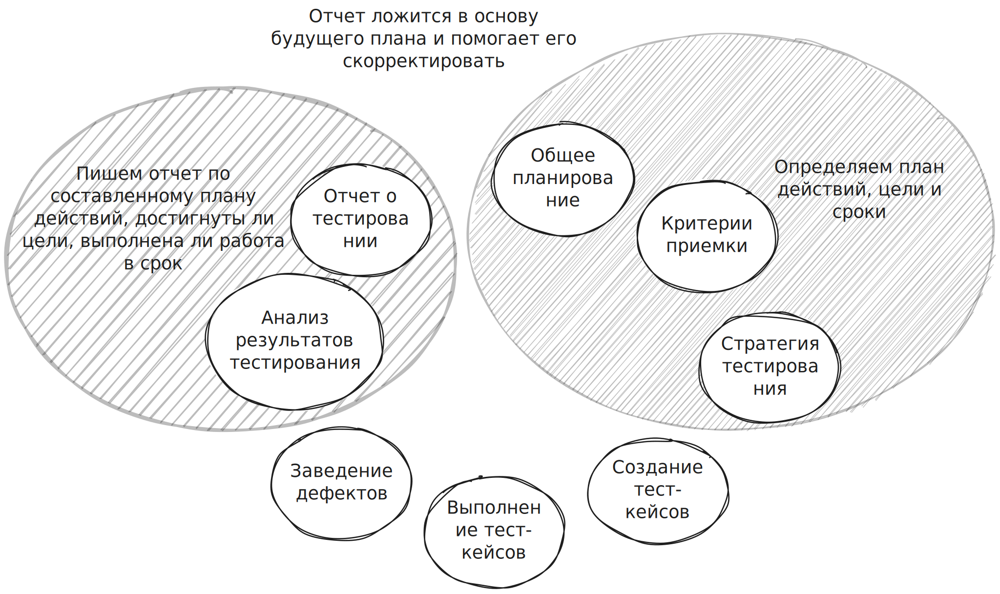

**Планирование тестирования** – составление плана тестирование и его поддержка в актуальном состоянии.

**План тестирования** – документация для координации тестовой деятельности, которая описывает цели тестирования, средства и график достижения целей.

## Цели и задачи планирования

- Объем и сложность работы
  Что именно тестировать? Как много работы? На сколько сложная работа? Корректность постановки задачи? Возможность декомпозировать задачу?
- Ресурсы и способы их получения
  Имеются ли необходимые ресурсы? Если нет, то как их получить?
- Планирование времени и ключевых этапов
  Если проект длится долгое время, нужно определить когда приступить к работе, когда завершить работу. На большом проекте можно отметить некие ключевые этапы/точки.
- Определение рисков и принятие контрмер
  Контрмеры могут предотвратить риск или снизить до минимума последствия риска.
- Распределение обязанностей и ответственностей
  Знать кто за что отвечает, к кому обращаться. Для того, чтобы не оказаться в ситуации, когда какая-то работы не будет выполнена или одну работу выполнили 5 раз.
- Координация между людьми/командами/проектами

## Почему план тестирования важен?

Тестовый план – это основа для всех дальнейших действий и основа для отчетности.
Если мы написали хороший план тестирования, то по этому плану получится хороший отчет о тестировании. Этот отчет ляжет в основу будущего плана.

## Чем помогает тест-план?

- Лучшие результаты с меньшим количеством затрат
  Нету суеты. Ресурсы распределены. Каждый понимает что и когда должен делать. Люди работают более эффективно.
- Оптимизация ресурсов, избегание пустых затрат
  Каждый человек знает чем заниматься. Одна и та же работа не будет выполнена несколько раз.
- План позволяет видеть на сколько мы продвинулись к поставленной цели
  Если отстаем от графика нужно подумать как ускориться. Если опережаем график, то подумать как закрепить успех. Идем к намеченной цели или свернули в сторону?
- Понимание что делать в любой ситуации, даже если что-то пошло не так
  Предотвращение рисков в действии.
- Лучшее понимание и взаимодействие между людьми
  Человек понимает за что он отвечает, что с него спросят, к чему ему приступить, что лучше не трогать. Лучшее понимание организации на проекте.