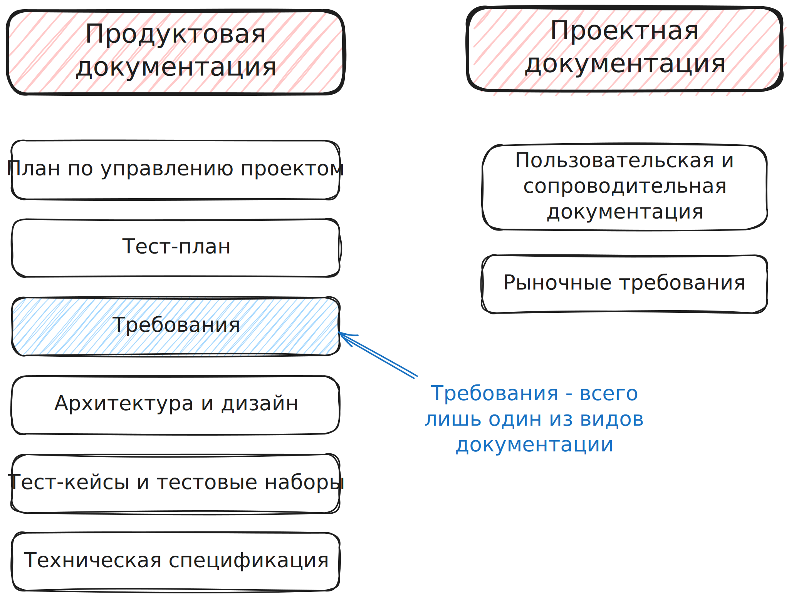
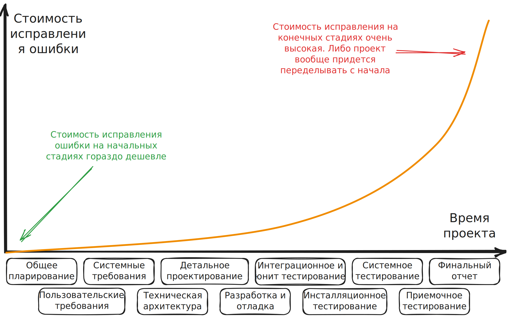
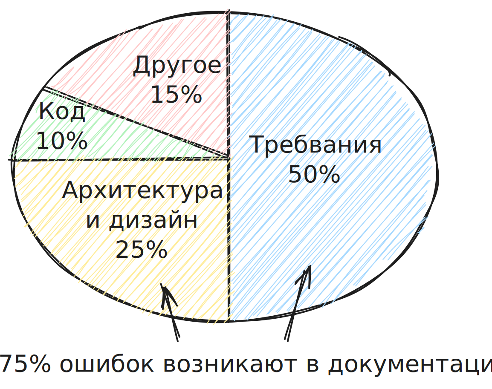

## Что такое требования?

**Требования** - документ, в котором описано, ЧТО должно быть реализовано и КАК это должно быть реализовано, каким условиям должно удовлетворять.

Пример из реальной жизни - правила дорожного движения. Это требования необходимые для вождения автомобиля.

## Какие бывают виды документаций?

Видов документации бывает большое количество. Требования - всего лишь один из них.

## Почему документация важна?

Без документации продукт может получиться не таким каким он задуман изначально.

Из-за того, что проект не был задокументарован возникали проблемы на каждой стадии. 

По итогам никто не оказывается в выигрыше: 

- Заказчик и пользователи не получили что хотели
- Компания получила репутационный ущерб
- Разработчики сделали работу, которая никому оказалась не нужна

!!! example "Постройка дома"

	Строители неверно посмотрели на чертеж и установили фундамент так, что дом оказался не той стороной. Выяснилось это на этапе установки крыши.
	Исправить эту ошибку в самом начале строительства стоит 0 рублей (посмотреть на четреж еще раз), но в конце строительства нужно сносить дом и строить его заново. Это очень дорого.

Требования в проекте появляются на раннем этапе. Именно поэтому они важны для раннего замечания и устранения дефектов.

Если на проекте правильно организовать работу с документацией, то можно в избежать большого количества потенциальных ошибок.
