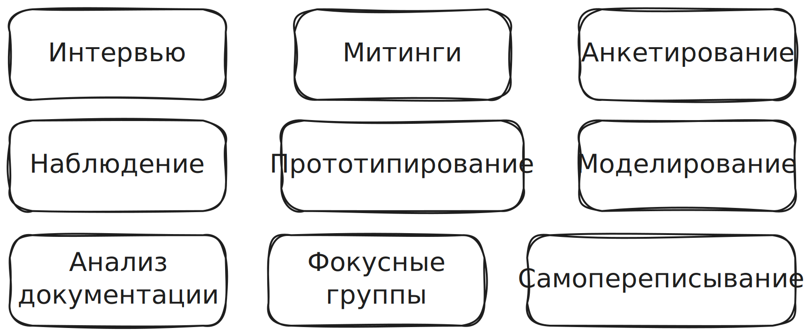

## Интервью

Коммуникация 2-х людей. Например, бизнес аналитик общается с представителем клиента. 

!!! info "Плюсы и минусы интервью"

	:material-plus: быстро и легко
	:material-plus: все понимают концерт интервью
	:material-plus: проходить может как угодно: личная встреча, звонок, почта, чаты и тд.
	 
	 :material-minus: лучше подготовить визуальную информацию (картинки, графики)
	 :material-minus: требуется время чтобы результат интервью переработать в полезную информацию для других людей
	 :material-minus: вся ответственность за информацию лежит на одном человеке

## Митинги

В процессе участвуют несколько человек, в отличие от интервью. 

!!! info "Плюсы и минусы митингов"

	:material-plus: сразу несколько людей делятся и получают информацию
	:material-plus: митинги на много быстрее чем переписки по почте или в чатах
	:material-plus: могут рождаться хорошие идеи
	 
	 :material-minus: занимают очень много времени
	 :material-minus: сложно собрать всех вместе
	 :material-minus: если митингов много, то они становятся скучными и неэффективными

## Анкетирование (опросники)

Способ сбора информации от большого количества людей.

!!! info "Плюсы и минусы анкетирования"

	:material-plus: большое покрытие аудитории
	:material-plus: результаты опросов можно представлять в виде удобных графиков
	:material-plus: возможность сравнивать результаты повторных опросов
	 
	 :material-minus: если составить направильные вопросы или выбрать не ту аудиторию, то можно не получить нужных данных или получить неправильные данные.

## Наблюдение

Люди могут чего-то не знать, не досказать или забыть. А могут и соврать. Наблюдая со стороны, человек может получить дополнительную нужную информацию.

!!! info "Плюсы и минусы наблюдения"

	:material-plus: можно получить очень важные детали
	:material-plus: информация получается боле объективная (а не с чьих то слов)
	:material-plus: результаты наблюдения могут привести к пересмотру решаемой проблемы
	 
	 :material-minus: сложно организовать
	 :material-minus: опытных наблюдателей мало
	 :material-minus: плохая организация наблюдения дает недостоверную информацию

## Прототипирование

Создание чего-то более реального, физического. Например, схема, изображение и тд.

!!! info "Плюсы и минусы прототипирования"

	:material-plus: большинство людей лучше понимают то, что они видят
	:material-plus: предоставляет больше информации, чем очень детальное описание. Например, просмотр картины дает больше информации, чем ее детальное описание.
	 
	 :material-minus: занимает много времени

## Моделирование

Похоже на прототипирование. Позволяет с помощью математических функций и рассчетов получать результаты. Например, смоделировать землетрясение для проверки прочности строящегося здания.

!!! info "Плюсы и минусы моделирования"

	:material-plus: проще понять сложные вещи
	:material-plus: могут показать скрытые свойства объекта. Например, при землетрясении возникать дополнительные вибрации в здании.
	:material-plus: показывает на сколько правильное решение было выбрано и можно ли его улучшить
	 
	 :material-minus: требуется много опыта, знаний, инструментов
	 :material-minus: неверные модели дают ложные данные
	 :material-minus: сложнее в понимании чем прототипы

## Анализ документации

Просто чтение документации. 

!!! info "Плюсы и минусы анализа документации"

	:material-plus: можно читать в любое время и в любом месте
	
	:material-minus: новая информация пораждает новые вопросы. Потребуется время чтобы ответить на новые вопросы.
	:material-minus: работа в одного, можно пропустить что-то или полениться разобраться в чем-то.

## Фокусные группы

В отличие от анкетирования, здесь более тесное взаимодействие с пользователями. В идеале заочное.

!!! info "Плюсы и минусы фокусных групп"

	:material-plus: получение обратной связи от реальных пользователей
	:material-plus: более глубокое вовлечение
	
	:material-minus: организация процесса
	:material-minus: NDA

## Самопереписывание информации

Переработка информации полученной в других видах сбора требований. Эту информацию стоит привести к единому виду. 

!!! info "Минусы самопереписывания"
	
	:material-minus: есть вероятность добавления своих мылей/идей в требования
