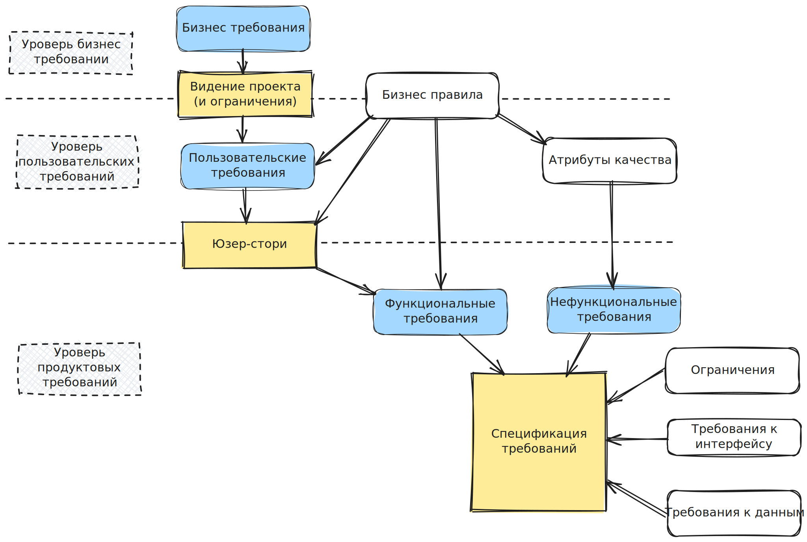
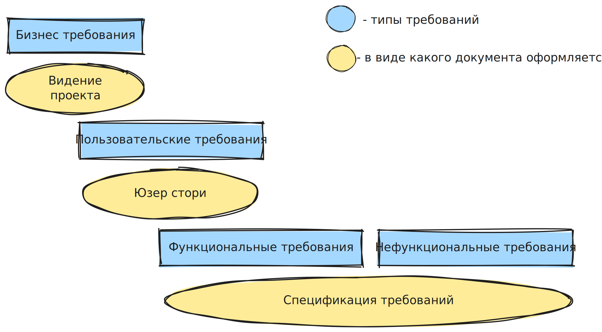

  

## Упрощенная схема требований  

  

## Бизнес-требования

**Бизнес-требования** – требования, которые показывают цель, ради которой будет разрабатываться продукт.  

!!! example "Пример"  

	Нужен инструмент для отображения прибыльных курсов валют в реальном времени.  
## Пользовательские требования

**Пользовательские требования** – описывают, что пользователи могут делать и как ПО будет реагировать.  

Оформляется в виде юзер сторис: я как кто, делаю что, зачем.  

Юзер стори формируются, отвечая на вопросы:  

- кто я?  
- что делаю?  
- зачем?  

!!! example "Пример"  

	Я как администратор выделяю сразу несколько страниц, чтобы все их одновременно удалить.  

## (Не)функциональные требования

**Функциональные требования** – показывают, **ЧТО** система должна делать.  
**Нефункциональные требования** – показывают, **КАК** система должна делать.  

!!! example "Пример"  

	Птица должна летать – это функция, высоко – это нефункциональная составляющая.