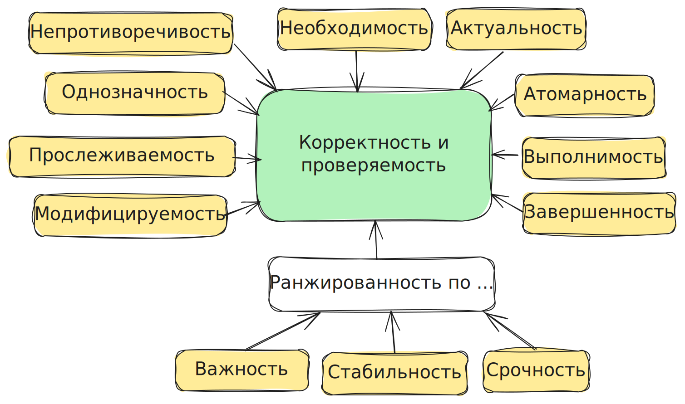
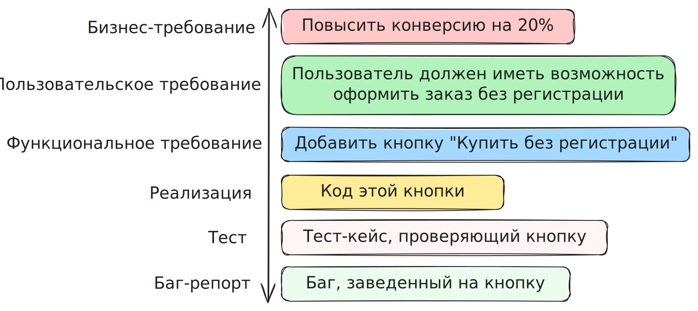

## Атомарность

Каждое требование должно описывать только одну функцию. Или, другими словами, требование нельзя разбить на более мелкие части без потери смысла.

!!! example "Например"  
	:fontawesome-solid-xmark: Система должна сохранять данные и отправлять уведомление пользователю.

## Завершенность

Требование предоставляет всю необходимую информацию. Ничего не упущено. 

!!! example "Например"  
	:fontawesome-solid-xmark: Система должна отправлять уведомление пользователю при ошибке.  
	:fontawesome-solid-question: Какой тип ошибки?  
	:fontawesome-solid-question: Какой текст уведомления?  
	:fontawesome-solid-question: Каким способом (email, push, sms)?

## Непротиворечивость

Требования непротиворечат сами себе.

!!! example "Например"  
	:fontawesome-solid-xmark: В одном месте написано, что кнопка должна быть красная, в другом, что оранжевая.  
	:fontawesome-solid-xmark: В таблице/картинке одно описание, а в тексте другое.

## Однозначность

Требования понятны всем одинаково.

В требованиях не используются непонятные аббревиатуры или слова типа "быстро", "легко" и т.д., в которые каждый может вложить свой смысл.

!!! example "Например"  
	:fontawesome-solid-xmark: Система должна быстро обрабатывать заказы.  
	:fontawesome-solid-question: Насколько быстро? Нужны конкретные цифры/формулы.

## Необходимость и актуальность требований

Все, что встречается в требованиях, должно быть необходимым и актуальным. Требования часто меняются, поэтому в них не должно быть неактуальной информации.

## Выполнимость

Возможность выполнить требование с точки зрения технических возможностей, времени, денег.

!!! example "Например"  
	:fontawesome-solid-xmark: Система должна загружаться за 0,001 секунды при любом интернет-соединении.

## Прослеживаемость

Возможность отследить, как одни требования связаны с другими артефактами проекта.

Артефакты проекта:

- задачи  
- тест-кейсы  
- дефекты  
- код

Бывает ==вертикальная прослеживаемость== – показывает связи между [уровнями требований](3.3%20Уровни%20и%20типы%20требований.md) и этапами разработки.

И бывает ==горизонтальная прослеживаемость== – показывает связи между требованиями на одном уровне.

!!! example "Например"  
	Требование 1  
	:fontawesome-solid-link: Пользователь должен иметь возможность восстановить пароль через email.

	 Требование 2  
	:fontawesome-solid-link: Письмо для восстановления должно содержать ссылку, действительную 15 минут.

Без прослеживаемости сложно поддерживать следующее важное свойство требований – модифицируемость.

## Модифицируемость

Возможность легко вносить изменения в требования, не создавая путаницу.

Другими словами, требования удобно менять и изменения не ломают логику.

==Нет прослеживаемости — нет модифицируемости.==

## Важность

Показывает, насколько от данного требования зависит успех проекта.

Важность показывает, на что направлять максимум усилий команды разработки.

## Стабильность

Показывает, что данное требование в будущем не будет изменяться (по крайней мере, в ближайшем будущем).

## Срочность

Показывает, что делать сейчас, а что потом. Не нужно путать с важностью.

## Корректность и проверяемость

Можно сказать, что это совокупность всех остальных свойств требований. Требования должны быть корректными и требования можно проверить.