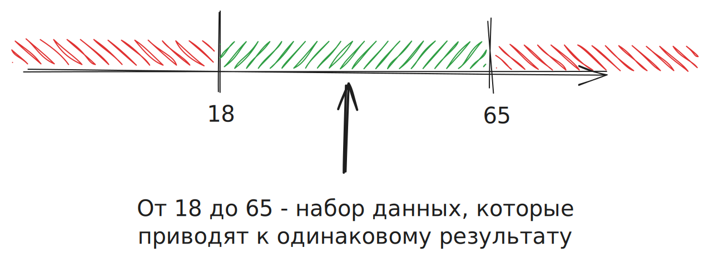
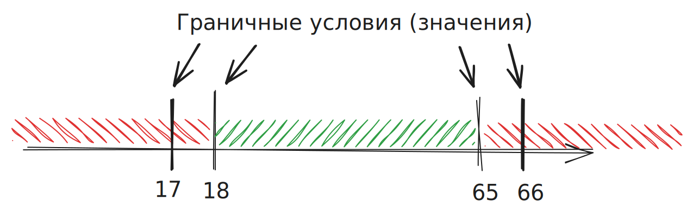

## Классы эквивалентности

Набор данных, который принимается программой одинаковым образом и приводит к одинаковому результату.

!!! example "Например"
	Вход на сайт разрешен только пользователям от 18 до 65 лет. Получается, что диапазон 18-65 это один класс эквивалентности.
	Числа до 18 и после 65 - это другой класс эквивалентности.

## Граничные условия

Границы, где один набор данных переходит в другой.

!!! example "Например"
	Вход на сайт разрешен только пользователям от 18 до 65 лет. В этом случае граничные значения это 17, 18, 65, 66.

## Задание на комбинацию КЭ и ГЗ

Функция принимает строку и возвращает true или false. 
Длина: 3-20 символов
Допустимые символы: числа, нижнее подчеркивание, английские буквы в нижнем и верхнем регистре.

Классы эквивалентности длины:

- `3-20 (валидная длина)`
- `0-2 (невалидная длина)`
- `21+ (невалидная длина)`

Граничные условия длины:

- `2`
- `3`
- `20`
- `21`

Классы эквивалентности символов:

- валидные:
	- `a-z` 
	- `A-Z`
	- `0-9`
	- `_`
- невалидные

{==

Комбинация классов эквивалентности и граничных условий:

- Валидная длина + валидные символы: **`ABC`**, **`ABCDEFGHIJKLMNOPQRST`**, **`abc_12_def`**
- Невалидная длина + валидные символы: **`AA`**, **`AAAAAAAAAAAAAAAAAAAAA`** (21 символ)
- Валидная длина + невалидные символы: **`Abcd#12345%^&*#`**

Всего получилось 7 тестов, вместо бесконечного множества.

==}

## Функциональный подход

Думать о функциях приложения: что приложение должно делать (а что нет) в каких-то ситуациях.

{==

**Дано 2 поля даты (начало и конец отпуска)**

1) Какие специальные требования к полям? (Возможно в разных странах разные правила заполнения дат отпусков)
2) Какая реакция на валидные и невалидные данные?
3) Могут ли она значения быть в прошлом? Или будущем?
4) Какая реакция на пустые значения?
5) Что будет если указать дату начала и конца одинаковой?
6) Какая максимальная и минимальная длина отпуска?
7) Могут ли даты начала и конца выпадать на выходные/праздничные дни?
8) ...

==}

Рекомендация к прочтению книг:
- A Practitioner's Guide to Software Test Design. Lee Copeland
- Black-Box Testing: Techniques for Functional Testing of Software and Systems. Boris Beizer